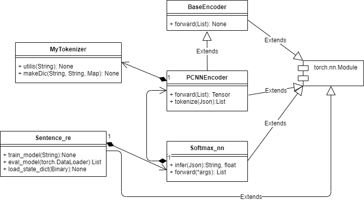

# Detailed Design

## Background

As a key concept in natural language processing, knowledge graph (KG) presents an approach to organize knowledge points in certain fields and visualize their relations. Several successful instances of KG, such as *BioBERT* in biological medicine, has been published. But up till now, no instance of KG in civil engineering has been published yet. Thus, this project has an objective of constructing a knowledge graph in the field of civil engineering.

Following steps are taken in the construction of our KG: named entity recognition (NER), word embedding and relation extraction. NER recognize named entities (mostly field-related terms) and extracts them from sentence. Word embeddings maps entities to vectors, which is later used in finding the most unrelated entity in the sentence and giving related words of entity specified. Relation extraction classifies the relations between every two entities in the sentence given.

The KG constructed by us was initially aimed at tunnel engineering. With the generalization ability of model, we has extended the scope of KG into civil engineering currently.

## Process Flow Design

- Sentence processing process flow


- Entity processing process flow


## Algorithm Design


### language modelling algorithm design

#### Background

From the machine learning perspective, language modelling is the modelling of the probability distribution of sentences with the aim of establishing a probability distribution that describes the occurrence of a given sequence of words in a language. This means that it is possible to determine whether a sequence of words is a normal utterance.

Word2vec characterizes the semantic information of words by learning the text and then using word vectors, i.e. mapping the original word space to a new space so that words that are semantically similar are close to each other in that space. The word is used for almost everything based on depth. 

Word2vec is used upstream in almost all deep learning-based NLP/knowledge mapping tasks, i.e. transforming text into vectors.

Also, Python has good packages for word vector training, namely Gensim, an open source third-party Python toolkit for unsupervised learning of topic vector representations from raw, unstructured text to the hidden layers of text. There are also good packages for Python to perform word separation on Chinese text, such as jieba.


#### Training process

1. familiar with the model: search word2vec related materials, understand the model principle, and build your own English word corpus and build the corresponding word2vec model, familiar with the model training API, such as the output word vector and word similarity, etc.
2. corpus collection: organize the corpus of papers crawled by the crawler and the Chinese wiki corpus as the base corpus in a folder
3. Corpus pre-processing: use jieba to sort the 6,000 pieces of corpus in turn and store them in the sorted corpus folder, keeping the file encoding format uniform (UTF-8/GBK)
4. model training: the processed corpus was used as input, and multiple files were read as a list of sentences, which were trained using the algorithm in the gensim library to obtain the word2vec model
5. model using: judge the similarity and mismatch of the input words
6. model comparison: the model was trained using the Chinese wiki corpus alone, and compared with the model with the pre-collection of civil engineering, to compare the prediction effect of similar words and word vector size of the same words


#### Training Improvements

1. Insufficient word separation accuracy during pre-processing.

   Introduced the civil engineering lexicon from the input method lexicon as a lexicon, improved the lexical separation and retrained the model to successfully improve the lexical separation accuracy

2. Poor prediction performance of the trained model.

   The model was improved by adding the Wikipedia corpus wiki_zh to the original corpus, mainly to improve the prediction of words that are general in nature.

3. Long training time, inconvenient to adjust parameters and recall

   Using gensim to provide an interface to save the model files locally, the model files are loaded directly when the interface is called or incremental training is required, eliminating the need for retraining.

   

#### Algorithm Characteristics and usage

1. transforming text into vectors
2. output the predicted results like similar words, irrelevant words and output similarity
3. adding Civil Engineering field corpus to fit the Civil Engineering word predict task


#### Key Operation

1. **pre-processing**

```python
# 导入词典
jieba.load_userdict('dict.txt')

# 分词处理
files = os.listdir(path)
for file in files:
    position = path + '\\' + file
    position_out = path_out + '/' + file
    print(position)
    with open(position, "rb") as f:
        document = f.read()
        document_cut = jieba.cut(document)
        result = ' '.join(document_cut)
        result = result.encode('utf-8')
        with open(position_out, 'wb') as f2:
            f2.write(result)
    f.close()
    f2.close()
```

2. **model training**

```python
# 导入已处理语料
sentences = word2vec.LineSentence(wiki_file)
model = Word2Vec(sentences, min_count=5, window=5, size=256,
                 workers=multiprocessing.cpu_count(), iter=10,
                 sg=1, )
# 保存模型
model.save("./models/wiki_w2v_model.model")
```

3. **model using**

```python
ce_file = "./models/added_w2v_model.bin"
wiki_file = "./models/wiki_w2v_model.bin"

# 词向量规模
model_ce = KeyedVectors.load_word2vec_format(ce_file)
model_wk = KeyedVectors.load_word2vec_format(wiki_file)
var_ce = len(model_ce.vocab)
var_wk = len(model_wk.vocab)
var_sub = var_ce - var_wk
var_vs = model_ce.vector_size
var_vs2 = model_wk.vector_size
print("wiki语料对应模型词向量个数为：", var_wk)
print("添加了土木语料对应模型词向量个数为：", var_ce)
print("共添加词向量：", var_sub)
print("词向量维度为：", var_vs, " 和", var_vs2)

//预测相似词与无关词
similarity_1 = model.most_similar('隧道')
similarity_2 = model.most_similar('金属')
li = ["金属", "合金", "隧道"]
print("与隧道最相似的词为：", similarity_1)
print("与金属最相似的词为：", similarity_2)
print("金属, 合金, 隧道中差别最大的词为：", model.doesnt_match(li))
```


#### Algorithm results

The number of model word vectors for the wiki corpus is: 683473
The number of word vectors added to the civil engineering corpus is: 706148
Total number of word vectors added: 22675
Word vector dimensions: 256 and 256

Comparison of the test results before and after the addition of the corpus：


### Relation Extraction

#### Overview

Relation extraction(RE) is one of Information Extraction's subtasks, with which we can get useful information from particular text materials. The objective of this task is to compute the relations absorbed in the input sentence or passage with the gotten entities from entity extraction task. Now, relation extraction is usually a classification task. Therefore, particular well-designed relations and well-annotated datasets are needed to achieve the objective.

#### Dataset

The dataset usually includes a relation2id file, which has all kinds of relations appearing in the dataset, and a file whose lines are quadri-tuples including a sentence, two entities, and the matching relations. For now, the group don't have a dataset with high quality that is about civil or tunnel engineering. As a result, the group use some general datasets to test the algorithms.

+ English dataset: nyt10(new york times news); wiki80(wikipedia); SemEval2010(from OpenNRE)

  ```json
  % data sample
  {"text": "She also oversaw the refinancing of the state Superfund law ; the creation of a plan for decontaminating heavily polluted Onondaga Lake , near Syracuse ; the acquisition of hundreds of thousands of acres of Adirondack woodlands ; and the imposition of tough new acid rain rules .", "relation": "/location/location/contains", "h": {"id": "m.071cn", "name": "Syracuse", "pos": [143, 151]}, "t": {"id": "m.02_v74", "name": "Onondaga Lake", "pos": [122, 135]}}
  ```

+ Chinese dataset: CCKS2019(a people relation extraction competation's dataset) and Sanwen(a literature dataset), FinRe(a financial news dataset)(from several other git repositories)

  + word-based

  ```json
  {"tokens": ["生活", "的", "磨炼", "使", "母亲", "心胸开阔", "，", "明事", "达理", "，", "和睦", "邻里", "，", "精明能干", "。"], "h": {"name": "母亲", "pos": [4, 5]}, "t": {"name": "邻里", "pos": [11, 12]}, "relation": "Social"}
  ```

  + character-based

  ```json
  {"tokens": ["生", "活", "的", "磨", "炼", "使", "母", "亲", "心", "胸", "开", "阔", "，", "明", "事", "达", "理", "，", "和", "睦", "邻", "里", "，", "精", "明", "能", "干", "。"], "h": {"name": "母亲", "pos": [6, 8]}, "t": {"name": "邻里", "pos": [20, 22]}, "relation": "Social"}
  ```

#### Evalution

| dataset                         | token method    | f1 value |
| ------------------------------- | --------------- | -------- |
| Sanwen literature(12 relations) | word-based      | 0.642891 |
| Sanwen literature               | character-based | 0.655973 |
| FinRe financial(44 relations)   | word-based      | 0.520832 |
| FinRe financial                 | character-based | 0.507063 |

#### Key Operations

1. **Tokenization and data prepare:** Use some scripts to transform the original dataset to tensor form acting as the model's input.

   + **tokenization**

   For English datasets, the algorithm use " " to split sentences or phrases to words. There are two different tokenization methods for chinese dataset--word-based and character-based method. This step transform the original information to good form, which makes next step easy.

   ```python
   # word-based as example
   # build dictionary
   with open(os.path.join(root_path, "valid.txt"), 'r', encoding='utf-8') as data_file:
       for lines in data_file.readlines():
           if lines == "\n":
               continue
           head = lines.split()[0]
           tail = lines.split()[1]
           jieba.add_word(head)
           jieba.add_word(tail)
   
   with open(os.path.join(root_path, "valid.txt"), 'r', encoding='utf-8') as data_file:
       file = open(os.path.join(go_path, "valid.txt"), 'w', encoding='utf-8')
       for lines in data_file.readlines():
           if lines == "\n":
               continue
               # tokenize the sentence
           head = lines.split()[0]
           tail = lines.split()[1]
           rel = lines.split()[2]
           sentence = lines.split()[3]
           sentence = jieba.cut(sentence)
           tokens = []
           for words in sentence:
               if words == "<" or words == ">":
                   continue
               tokens.append(words)
           data = {"tokens": tokens}
           # add entities and positions
           i = 0
           p1 = p2 = -1
           for words in tokens:
               if words == head:
                   p1 = i
               elif words == tail:
                   p2 = i
               i += 1
           h = {"name": head, "pos": [p1, p1 + 1]}
           t = {"name": tail, "pos": [p2, p2 + 1]}
           data['h'] = h
           data['t'] = t
           data["relation"] = rel
           d = json.dumps(data, ensure_ascii=False)
           if p1 >= 0 and p2 >= 0:
               file.write(d)
               file.write("\n")
       file.close()
   ```

   + **data prepare**

   To achieve the objective of relation extraction, particular data form is designed. All the sentences in dataset can be transform to a 2-D matrix, which includes word embeddings and position embeddings. Word embeddings are vectors, and each vector represents a specific word. Words having similar meanings have closer vectors in the vector space. Position embeddings are different words' distances from entities. Because the datasets have 2 entities in their lines, the position embeddings are 2-D vectors.

   ```python
   # use the gotten word2vec result to make model's dictionary and word embeddings(numpy 2-D array)
   def makeDic(infile, dictionary):
       num = 0
       ndArray = []
       with open(infile, "r", encoding="utf-8") as infile:
           for lines in infile.readlines():
               word = lines.split()[0]
               dictionary[word] = num
               num += 1
               w2v = []
               # print(lines.split()[1])
               for i in range(1, 101):
                   value = float(lines.split()[i])
                   w2v.append(value)
               ndArray.append(w2v)
       return ndArray
   ```

2. **Model**

   The model's framework is like PCNN model mentioned in [paper](https://www.aclweb.org/anthology/D15-1203.pdf), which can be divided in 4 layers. Mainly use [OpenNRE](https://github.com/thunlp/OpenNRE) resporitory to implement, which is based on torch library.

   + **embedding layer:**To concatenate a sentence's all words' word embeddings and position embeddings and transform the gotten array to a torch tensor.

     ```python
     import torch.nn as nn
     import torch.nn.functional as F
     # Word embedding
     self.word_embedding = nn.Embedding(self.num_token, self.word_size)
     if word2vec is not None:
             word2vec = torch.from_numpy(word2vec)
             if self.num_token == len(word2vec) + 2:            
                 unk = torch.randn(1, self.word_size) / math.sqrt(self.word_size)
                 blk = torch.zeros(1, self.word_size)
                 self.word_embedding.weight.data.copy_(torch.cat([word2vec, unk, blk], 0))
             else:
                 self.word_embedding.weight.data.copy_(word2vec)
     # Position Embedding
     self.pos1_embedding = nn.Embedding(2 * max_length, self.position_size, padding_idx=0) self.pos2_embedding = nn.Embedding(2 * max_length, self.position_size, padding_idx=0)
     self.tokenizer = WordTokenizer(vocab=self.token2id, unk_token="[UNK]")
     # token 2 embeddings
     indexed_tokens = self.tokenizer.convert_tokens_to_ids(tokens, unk_id=self.token2id['[UNK]'])
     # Position 2 embedding
     pos1 = []
     pos2 = []
     pos1_in_index = min(pos_head[0], self.max_length)
     pos2_in_index = min(pos_tail[0], self.max_length)
     for i in range(len(tokens)):
         pos1.append(min(i - pos1_in_index + self.max_length, 2 * self.max_length - 1))
         pos2.append(min(i - pos2_in_index + self.max_length, 2 * self.max_length - 1))
     # transform 2 tensor
     indexed_tokens = torch.tensor(indexed_tokens).long().unsqueeze(0)  # (1, L)
     pos1 = torch.tensor(pos1).long().unsqueeze(0)  # (1, L)
     pos2 = torch.tensor(pos2).long().unsqueeze(0)  # (1, L)
     # concatenate
      x = torch.cat([self.word_embedding(indexed_tokens),
                            self.pos1_embedding(pos1),
                            self.pos2_embedding(pos2)], 2)  # (B, L, EMBED)
     # x is the final input tensor 
     ```

   + **convoluting layer:**Like normal CNN, there are several filters that process convoluted operation with the original tensor. 

     ```python
     self.conv = nn.Conv1d(self.input_size, self.hidden_size, self.kernel_size, padding=self.padding_size)
     x = self.conv(x) # pytorch library convlution operation
     ```

   + **pooling layer:**Split the received tensor by entities in 3 areas and process max pooling operation in each area. Then process a dropout operation to prevent overfitting.

     ```python
     self.drop = nn.Dropout(dropout)
     self.pool = nn.MaxPool1d(self.max_length)
     self.mask_embedding = nn.Embedding(4, 3)
     self.mask_embedding.weight.data.copy_(torch.FloatTensor([[0, 0, 0], [1, 0, 0], [0, 1, 0], [0, 0, 1]]))
     self.mask_embedding.weight.requires_grad = False
     self._minus = -self.pool = nn.MaxPool1d(self.max_length)
     self.act=torch.nn.Module.Functional.relu
     mask = []
     pos_min = min(pos1_in_index, pos2_in_index)
     pos_max = max(pos1_in_index, pos2_in_index)
     for i in range(len(tokens)):
             if i <= pos_min:
                 mask.append(1)
             elif i <= pos_max:
                 mask.append(2)
             else:
                 mask.append(3)
     mask = 1 - self.mask_embedding(mask).transpose(1, 2)  # (B, L) -> (B, L, 3) -> (B, 3, L)
     # pooling and apply relu activation function
     pool1 = self.pool(self.act(x + self._minus * mask[:, 0:1, :]))  # (B, H, 1)
     pool2 = self.pool(self.act(x + self._minus * mask[:, 1:2, :]))
     pool3 = self.pool(self.act(x + self._minus * mask[:, 2:3, :]))
     x = torch.cat([pool1, pool2, pool3], 1)  # (B, 3H, 1)
     x = x.squeeze(2)  # (B, 3H)
     x = self.drop(x)# dropout operation
     ```

   + **classifying layer:**Create a random transition matrix and operate it with the received tensor from pooling layer. The result will be a score vector representing all kinds of relations. Use softmax function to transform it to a probability distribution. Then the maximum value will be the prophetic relation. 

     ```python
     self.sentence_encoder=PCNNEncoder(*args)
     self.fc = nn.Linear(self.sentence_encoder.hidden_size, num_class)
     self.softmax = nn.Softmax(-1)
     
     logits = self.forward(*item)
     logits = self.softmax(logits)
     score, pred = logits.max(-1)
     
     def forward(self, *args):
         rep = self.sentence_encoder(*args)  # (B, H)
         rep = self.drop(rep)
         logits = self.fc(rep)  # (B, N)
         return logits
     ```

3. **Train**

   Set configuration and train the model.

   ```python
   # load some data
   rel2id = json.load(open(args.rel2id_file))
   
   word2id = json.load(open(os.path.join(root_path, 'word2id.json')), )
   word2vec = np.load(os.path.join(root_path, 'myvec.npy'))
   
   # Define the sentence encoder
   sentence_encoder = opennre.encoder.PCNNEncoder(
       token2id=word2id,
       max_length=args.max_length,
       word_size=100,
       position_size=10,
       hidden_size=230,
       blank_padding=True,
       kernel_size=3,
       padding_size=1,
       word2vec=word2vec,
       dropout=0.5
   )
   
   # Define the model
   model = opennre.model.SoftmaxNN(sentence_encoder, len(rel2id), rel2id)
   
   # Define the whole training framework
   framework = opennre.framework.SentenceRE(
       train_path=args.train_file,
       val_path=args.val_file,
       test_path=args.test_file,
       model=model,
       ckpt=ckpt,
       batch_size=args.batch_size,
       max_epoch=100,
       lr=args.lr,
       weight_decay=args.weight_decay,
       opt='sgd'
   )
   
   # Train the model
   if not args.only_test:
       framework.train_model(args.metric)
   
   # Test
   framework.load_state_dict(torch.load(ckpt)['state_dict'])
   result = framework.eval_model(framework.test_loader)
   ```

4. **Predict**

   Get a json string having a sentence and 2 entities, then return the prophetic relation and the probability.

   ```python
   # load a model
   def getModel(path):
       ckpt = './ckpt/sanwenchar_cnn_soft.pth.tar'
       rel2id = json.load(open(os.path.join(path, 'rel2id.json')))
       word2id = json.load(open(os.path.join(path, 'word2id.json')))
       word2vec = np.load(os.path.join(path, 'myvec.npy'))
       # Define the sentence encoder
       sentence_encoder = opennre.encoder.CNNEncoder(
           token2id=word2id,
           max_length=120,
           word_size=100,
           position_size=10,
           hidden_size=230,
           blank_padding=True,
           kernel_size=3,
           padding_size=1,
           word2vec=word2vec,
           dropout=0.5
       )
       # Define the model
       m = opennre.model.SoftmaxNN(sentence_encoder, len(rel2id), rel2id)
       m.load_state_dict(torch.load(ckpt, map_location='cpu')['state_dict'])
       return m
   # receive a json string and use a model to predict
   def jsonProcess(js, model):
       jsText = json.loads(js)
       tokens = []
       for words in jsText['sentence']:
           if words == "<" or words == ">":
               continue
           tokens.append(words)
       i = 0
       h = {}
       tails = []
       relations = []
       for entity in jsText['entities']:
           i += 1
           if i == jsText["chosen_entity"]:
               h["pos"] = entity
           else:
               tails.append({"pos": entity})
   
       data = {"tokens": tokens, "h": h}
       for entity in tails:
           data["t"] = entity
           relation = model.infer(data)
           relations.append(relation)
       return relations
   ```


### NER(Named Entity Recognition)

#### Overview

Named-entity recognition (NER) (also known as (named) entity identification, entity chunking, and entity extraction) is a subtask of information extraction that seeks to locate and classify named entities mentioned in unstructured text into pre-defined categories such as person names, organizations, locations, medical codes, time expressions, quantities, monetary values, percentages, etc.

#### Dataset

The dataset should be arranged in sentence level, and be separated into two files.

+ English dataset:

  + seq.in

  ```
  i want to fly from baltimore to dallas round trip
  round trip fares from baltimore to philadelphia less than 1000 dollars round trip fares from denver to philadelphia less than 1000 dollars round trip fares from pittsburgh to philadelphia less than 1000 dollars
  show me the flights arriving on baltimore on june fourteenth
  what are the flights which depart from san francisco fly to washington via indianapolis and arrive by 9 pm
  which airlines fly from boston to washington dc via other cities
  ```

  + seq.out

  ```
  O O O O O B-fromloc.city_name O B-toloc.city_name B-round_trip I-round_trip
  B-round_trip I-round_trip O O B-fromloc.city_name O B-toloc.city_name B-cost_relative O B-fare_amount I-fare_amount B-round_trip I-round_trip O O B-fromloc.city_name O B-toloc.city_name B-cost_relative O B-fare_amount I-fare_amount B-round_trip I-round_trip O O B-fromloc.city_name O B-toloc.city_name B-cost_relative O B-fare_amount I-fare_amount
  O O O O O O B-toloc.city_name O B-arrive_date.month_name B-arrive_date.day_number
  O O O O O O O B-fromloc.city_name I-fromloc.city_name O O B-toloc.city_name O B-stoploc.city_name O O B-arrive_time.time_relative B-arrive_time.time I-arrive_time.time
  O O O O B-fromloc.city_name O B-toloc.city_name B-toloc.state_code O O O
  ```

  

+ Chinese dataset: universal dataset is mainly from People's Daily which is already tagged. Tunnel-related dataset is collected and processed by our team.

  + universal.in

  ```
  人 民 网 1 月 1 日 讯 据 《 纽 约 时 报 》 报 道 , 美 国 华 尔 街 股 市 在 2 0 1 3 年 的 最 后 一 天 继 续 上 涨 , 和 全 球 股 市 一 样 , 都 以 最 高 纪 录 或 接 近 最 高 纪 录 结 束 本 年 的 交 易 。
  《 纽 约 时 报 》 报 道 说 , 标 普 5 0 0 指 数 今 年 上 升 2 9 . 6 % , 为 1 9 9 7 年 以 来 的 最 大 涨 幅 ; 道 琼 斯 工 业 平 均 指 数 上 升 2 6 . 5 % , 为 1 9 9 6 年 以 来 的 最 大 涨 幅 ; 纳 斯 达 克 上 涨 3 8 . 3 % 。
  就 1 2 月 3 1 日 来 说 , 由 于 就 业 前 景 看 好 和 经 济 增 长 明 年 可 能 加 速 , 消 费 者 信 心 上 升 。 工 商 协 进 会 ( C o n f e r e n c e B o a r d ) 报 告 , 1 2 月 消 费 者 信 心 上 升 到 7 8 . 1 , 明 显 高 于 1 1 月 的 7 2 。
  另 据 《 华 尔 街 日 报 》 报 道 , 2 0 1 3 年 是 1 9 9 5 年 以 来 美 国 股 市 表 现 最 好 的 一 年 。 这 一 年 里 , 投 资 美 国 股 市 的 明 智 做 法 是 追 着 “ 傻 钱 ” 跑 。 所 谓 的 “ 傻 钱 ” 策 略 , 其 实 就 是 买 入 并 持 有 美 国 股 票 这 样 的 普 通 组 合 。 这 个 策 略 要 比 对 冲 基 金 和 其 它 专 业 投 资 者 使 用 的 更 为 复 杂 的 投 资 方 法 效 果 好 得 多 。 ( 老 任 )
  人 民 网 平 壤 1 月 1 日 电 ( 记 者 王 莉 、 程 维 丹 ) 朝 鲜 最 高 领 导 人 金 正 恩 1 日 通 过 朝 鲜 各 大 媒 体 发 表 2 0 1 4 年 新 年 贺 词 , 向 朝 鲜 全 体 军 民 致 以 新 年 问 候 , 强 调 在 新 的 一 年 里 将 继 续 加 强 经 济 强 国 建 设 , 提 高 人 民 生 活 水 平 , 加 强 国 防 力 量 , 在 祖 国 统 一 斗 争 中 取 得 新 的 进 展 。 这 一 新 年 贺 词 被 视 为 朝 鲜 未 来 一 年 工 作 的 指 导 方 针 。
  ```

  + universal.out

  ```json
  O O O B_T I_T I_T I_T O O O B_LOC I_LOC O O O O O O B_LOC I_LOC I_LOC I_LOC I_LOC O O O B_T I_T I_T I_T I_T O O O O O O O O O O O O O O O O O O O O O O O O O O O O O O O O O O O O O O O
  O B_LOC I_LOC O O O O O O O O O O O O O O B_T I_T O O O O O O O O O B_T I_T I_T I_T I_T O O O O O O O O B_ORG I_ORG I_ORG O O O O O O O O O O O O O O O B_T I_T I_T I_T I_T O O O O O O O O B_PER I_PER O O O O O O O O O O
  O B_T I_T I_T I_T I_T I_T O O O O O O O O O O O O O O O O B_T I_T O O O O O O O O O O O O O O O O O O O O O O O O O O O O O O O O O O O O O O B_T I_T I_T O O O O O O O O O O O O O O O O O B_T I_T I_T O O O O
  O O O B_LOC I_LOC I_LOC O O O O O O B_T I_T I_T I_T I_T O B_T I_T I_T I_T I_T O O B_LOC I_LOC O O O O O O O O O O O O O O O O O B_LOC I_LOC O O O O O O O O O O O O O O O O O O O O O O O O O O O O O O O O O O O B_LOC I_LOC O O O O O O O O O O O O O O O O O O O O O O O O O O O O O O O O O O O O O O O O O O O O O O O O O O
  O O O B_LOC I_LOC I_T I_T I_T I_T O O O O B_PER I_PER O B_PER I_PER I_PER O B_LOC I_LOC O O O O O B_PER I_PER I_PER I_T I_T O O B_LOC I_LOC O O O O O O B_T I_T I_T I_T I_T I_T I_T O O O O B_LOC I_LOC O O O O O O B_T I_T O O O O O O O O O O O O O O O O O O O O O O O O O O O O O O O O O O O O O O O O O O O O O O O O O O O O O O O O B_T I_T O O O O O B_LOC I_LOC I_T I_T O O O O O O O O O O
  ```

  + tunnel.in

  ```
  管 节 纵 断 面 迎 流 横 江 浮 运 红 谷 隧 道 管 节 纵 断 面 迎 流 横 江 浮 运 作 为 创 新 点 有 个 过 程 ： 一 是 管 节 绞 拉 出 坞 ， 干 坞 内 的 水 流 速 很 小 ， 而 管 节 出 坞 后 纵 断 面 受 横 向 水 流 的 影 响 ， 存 在 往 下 游 偏 移 搁 浅 的 重 大 风 险 ； 二 是 过 第 座 大 桥 前 ， 管 节 需 转 体 至 平 行 于 水 流 方 向 ， 转 体 过 程 中 ， 迎 流 面 积 从 最 大 变 到 最 小 ， 该 过 程 受 力 极 其 复 杂 ； 三 是 管 节 在 调 头 回 旋 区 打 横 调 头 及 进 隧 址 ， 受 江 心 洲 及 东 岸 围 堰 影 响 ， 河 道 宽 度 大 幅 度 缩 窄 ， 导 致 赣 江 东 汊 航 道 水 流 速 激 增 及 水 流 向 变 得 复 杂 ， 风 险 极 大 。 
  施 工 中 ， 首 次 创 新 采 用 了 “ 挂 拖 绑 拖 牵 拖 吊 拖 地 锚 ” 的 混 合 拖 航 浮 运 管 节 关 键 技 术 ， 解 决 了 上 述 风 险 。 
  窄 航 道 长 距 离 浮 运 管 节 红 谷 隧 道 为 国 内 首 座 江 河 中 游 沉 管 法 隧 道 ， 浮 运 航 道 自 干 坞 起 ， 沿 途 穿 越 生 米 大 桥 、 朝 阳 大 桥 和 南 昌 大 桥 ， 最 后 到 达 隧 址 ， 全 长 ， 受 季 节 性 降 水 影 响 ， 水 位 和 流 速 变 化 幅 度 大 ， 且 浮 运 航 道 距 离 长 ， 水 位 标 高 控 制 严 ， 航 道 窄 且 多 次 蜿 蜒 转 向 ， 施 工 风 险 大 ， 浮 运 窗 口 期 较 少 。 
  红 谷 隧 道 浮 运 航 道 平 面 示 意 图 如 图 所 示 。
  ```

  + tunnel.out

  ```
  O O B_x I_x I_x O O O O O O O O B_x I_x O O B_x I_x I_x O O O O O O O O O O O O O O O O O O O O O O O O O O O O O O O O O O O O O O O O O B_x I_x I_x O O O O O O O O O O O O O O O O O O O O O O O O O O O O O O O O O O O O B_x I_x O O O O O O O O O B_x I_x O O O O O O O O O O O O O O O O O O O B_x I_x O O O O O O O O O O O O O O O O O O O O O O O O O O O O O O O B_x I_x O O O B_x I_x B_x I_x O O O O O O O O O O O O O O O O O O O O O O O O O O O O O O O O O 
  O O O O O O O O O O O O O O O O O O O O O O O O O O O O O O O O O O O O O O O O O O O O O 
  O O O O O O O O O O O O B_x I_x O O O O O O O O O O O O B_x I_x O O O O O O O O O O O O O O O O O O O O O O O O O O O O O O O O O O O O O O O O O O O O O O O O B_x I_x O O O O O O O O O O O O O O O O O O B_x I_x B_x I_x O O O O O O O O O O O O O O O O O O O O O O O O O O O O O 
  O O B_x I_x O O O O B_x I_x I_x I_x I_x O O O O O 
  ```

#### Evalution

| dataset                   | f1 value | precision |
| ------------------------- | -------- | --------- |
| English dataset           | 0.98     | 0.99      |
| Chinese universal dataset | 0.92     | 0.9       |
| Chinese tunnel dataset    | 0.5~0.7  | 0.6       |

#### Key Operations

In this part, we will just focus on Chinese NER part.

##### data prepare: 

Use some scripts to transform the original dataset to meet the needs of NER.

##### Tokenization:

1. split sentence into word tokens
2. map tokens to numbers
3. add masks
4. wrap with [CLS] and [SEP] as an input to ALBERT
5. Use ALBERT output as embedding layer of LSTM

```python
def read_corpus(train_file_data, train_file_tag, max_length, label_dic):
    """
    :param train_file_data:训练数据
    :param train_file_tag: 训练数据对应的标签
    :param max_length: 训练数据每行的最大长度
    :param label_dic: 标签对应的索引
    :return:
    """

    VOCAB = config['albert_vocab_path']  # your path for model and vocab
    tokenizer = BertTokenizer.from_pretrained(VOCAB)
    result = []
    with open(train_file_data, 'r', encoding='utf-8') as file_train:
        with open(train_file_tag, 'r', encoding='utf-8') as file_tag:
            train_data = file_train.readlines()
            tag_data = file_tag.readlines()
            for text, label in zip(train_data, tag_data):
                tokens = text.split()
                label = label.split()
                if len(tokens) > max_length-2: #大于最大长度进行截断
                    tokens = tokens[0:(max_length-2)]
                    label = label[0:(max_length-2)]
                tokens_cs ='[CLS] ' + ' '.join(tokens) + ' [SEP]'
                label_cs = "[CLS] " + ' '.join(label) + ' [SEP]'
                # token -> index
                tokenized_text = tokenizer.tokenize(tokens_cs)  # 用tokenizer对句子分词
                input_ids  = tokenizer.convert_tokens_to_ids(tokenized_text)  # 索引列表

                # tag -> index
                label_ids = [label_dic[i] for i in label_cs.split()]
                input_mask = [1] * len(input_ids)

                while len(input_ids) < max_length:
                    input_ids.append(0)
                    input_mask.append(0)
                    label_ids.append(0)
                assert len(input_ids) == max_length
                assert len(input_mask) == max_length
                assert len(label_ids) == max_length
                feature = InputFeatures(input_id=input_ids, input_mask=input_mask, label_id=label_ids)
                result.append(feature)
    return result
```

##### Model

The model is based on ALBERT. We mainly introduce `BiLSTMCRF` part here.


+ **BiLSTM layer:** 

  The picture above illustrates that the outputs of BiLSTM layer are the scores of each label. For example, for w0w0，the outputs of BiLSTM node are 1.5 (B-Person), 0.9 (I-Person), 0.1 (B-Organization), 0.08 (I-Organization) and 0.05 (O). These scores will be the inputs of the CRF layer.

  ```python
  import numpy as np
  
  import torch
  from torch import nn
  
  from albert.model.modeling_albert import BertConfig, BertModel
  from albert.configs.base import config
  from lstm_crf.crf import CRF
  from sklearn.metrics import f1_score, classification_report
  class BiLSTMCRF(nn.Module):
  
      def __init__(
              self,
              tag_map={ 
                     'B_x': 0,
                     'I_x': 1,
                          'O': 2},
              batch_size=20,
              hidden_dim=128,
              dropout=1.0,
              embedding_dim=100
      ):
          super(BiLSTMCRF, self).__init__()
          self.batch_size = batch_size
          self.hidden_dim = hidden_dim
          self.embedding_dim = embedding_dim
          self.dropout = dropout
  
          self.tag_size = len(tag_map)  # 标签个数
          self.tag_map = tag_map
  
          bert_config = BertConfig.from_pretrained(str(config['albert_config_path']), share_type='all')
          self.word_embeddings = BertModel.from_pretrained(config['bert_dir'], config=bert_config)
          self.word_embeddings.to(DEVICE)
          self.word_embeddings.eval()
  
          self.lstm = nn.LSTM(self.embedding_dim, self.hidden_dim // 2,
                              num_layers=1, bidirectional=True, batch_first=True, dropout=self.dropout)
          self.hidden2tag = nn.Linear(self.hidden_dim, self.tag_size)
          self.crf = CRF(self.tag_size)
  ```

+ **CRF layer:** 

  Then, all the scores predicted by the BiLSTM blocks are fed into the CRF layer. In the CRF layer, the label sequence which has the highest prediction score would be selected as the best answer.

  ```python
  class CRF(nn.Module):
      """线性条件随机场"""
      def __init__(self, num_tag):
          if num_tag <= 0:
              raise ValueError("Invalid value of num_tag: %d" % num_tag)
          super(CRF, self).__init__()
          self.num_tag = num_tag
          self.start_tag = num_tag
          self.end_tag = num_tag + 1
          # 转移矩阵transitions：P_jk 表示从tag_j到tag_k的概率
          # P_j* 表示所有从tag_j出发的边
          # P_*k 表示所有到tag_k的边
          self.transitions = nn.Parameter(torch.Tensor(num_tag + 2, num_tag + 2))
          nn.init.uniform_(self.transitions, -0.1, 0.1)
          self.transitions.data[self.end_tag, :] = -10000   # 表示从EOS->其他标签为不可能事件, 如果发生，则产生一个极大的损失
          self.transitions.data[:, self.start_tag] = -10000   # 表示从其他标签->SOS为不可能事件, 同上
  
      def real_path_score(self, features, tags):
          """
          features: (seq_len, num_tag)
          tags:real tags
          real_path_score表示真实路径分数
          它由Emission score和Transition score两部分相加组成
          Emission score由LSTM输出结合真实的tag决定，表示我们希望由输出得到真实的标签
          Transition score则是crf层需要进行训练的参数，它是随机初始化的，表示标签序列前后间的约束关系（转移概率）
          Transition矩阵存储的是标签序列相互间的约束关系
          在训练的过程中，希望real_path_score最高，因为这是所有路径中最可能的路径
          """
          r = torch.LongTensor(range(features.size(0)))
          r = r.to(DEVICE)
          pad_start_tags = torch.cat([torch.LongTensor([self.start_tag]).to(DEVICE), tags])
          pad_stop_tags = torch.cat([tags, torch.LongTensor([self.end_tag]).to(DEVICE)])
          # Transition score + Emission score
          score = torch.sum(self.transitions[pad_start_tags, pad_stop_tags]) + torch.sum(features[r, tags])
          return score
  ```

##### Train

Set configuration and train the model.

```python
    def train(self):
        self.model.to(DEVICE)
        #weight decay是放在正则项（regularization）前面的一个系数，正则项一般指示模型的复杂度，所以weight decay的作用是调节模型复杂度对损失函数的影响，若weight decay很大，则复杂的模型损失函数的值也就大。
        optimizer = optim.Adam(self.model.parameters(), lr = 0.001, weight_decay=0.0005)
        '''
        当网络的评价指标不在提升的时候，可以通过降低网络的学习率来提高网络性能:
        optimer指的是网络的优化器
        mode (str) ，可选择‘min’或者‘max’，min表示当监控量停止下降的时候，学习率将减小，max表示当监控量停止上升的时候，学习率将减小。默认值为‘min’
        factor 学习率每次降低多少，new_lr = old_lr * factor
        patience=10，容忍网路的性能不提升的次数，高于这个次数就降低学习率
        verbose（bool） - 如果为True，则为每次更新向stdout输出一条消息。 默认值：False
        threshold（float） - 测量新最佳值的阈值，仅关注重大变化。 默认值：1e-4
        cooldown(int)： 冷却时间“，当调整学习率之后，让学习率调整策略冷静一下，让模型再训练一段时间，再重启监测模式。
        min_lr(float or list):学习率下限，可为 float，或者 list，当有多个参数组时，可用 list 进行设置。
        eps(float):学习率衰减的最小值，当学习率变化小于 eps 时，则不调整学习率。
        '''
        # schedule = ReduceLROnPlateau(optimizer=optimizer, mode='min',factor=0.1,patience=100,verbose=False)
        total_size = self.train_data.train_dataloader.__len__()
        for epoch in range(10):
            index = 0
            print(sys.getdefaultencoding())
            for batch in self.train_data.train_dataloader:
                self.model.train()
                index += 1
                self.model.zero_grad()  # 与optimizer.zero_grad()作用一样
                batch = tuple(t.to(DEVICE) for t in batch)
                b_input_ids, b_input_mask, b_labels, b_out_masks = batch

                bert_encode = self.model(b_input_ids, b_input_mask)
                loss = self.model.loss_fn(bert_encode=bert_encode, tags=b_labels, output_mask=b_out_masks)
                progress = ("#" * int(index * 25 / total_size)).ljust(25)
                print("""epoch [{}] |{}| {}/{}\n\tloss {:.2f}""".format(
                    epoch, progress, index, total_size, loss.item()))
                loss.backward()
                # torch.nn.utils.clip_grad_norm_(self.model.parameters(),1) #梯度裁剪
                optimizer.step()
                # schedule.step(loss)
                if index % 10 == 0:
                    self.eval_2()
                    print("-" * 50)
        torch.save(self.model.state_dict(), self.model_path + 'params.pkl')
        self.eval_2()
        print("-" * 50)
```

##### Predict

Get a input string having a sentence, then return the entity.

```python
    def predict(self, input_str=""):
        self.model.eval()  # 取消batchnorm和dropout,用于评估阶段
        self.model.to(DEVICE)
        VOCAB = config['albert_vocab_path']  # your path for model and vocab
        tokenizer = BertTokenizer.from_pretrained(VOCAB)
        with torch.no_grad():
            #input_str = input("请输入文本: ")
            input_ids = tokenizer.encode(input_str,add_special_tokens=True)  # add_spicial_tokens=True，为自动为sentence加上[CLS]和[SEP]
            input_mask = [1] * len(input_ids)
            output_mask = [0] + [1] * (len(input_ids) - 2) + [0]  # 用于屏蔽特殊token

            input_ids_tensor = torch.LongTensor(input_ids).reshape(1, -1)
            input_mask_tensor = torch.LongTensor(input_mask).reshape(1, -1)
            output_mask_tensor = torch.LongTensor(output_mask).reshape(1, -1)
            input_ids_tensor = input_ids_tensor.to(DEVICE)
            input_mask_tensor = input_mask_tensor.to(DEVICE)
            output_mask_tensor = output_mask_tensor.to(DEVICE)

            bert_encode = self.model(input_ids_tensor, input_mask_tensor)
            predicts = self.model.predict(bert_encode, output_mask_tensor)

            #print('paths:{}'.format(predicts))
            entities = []
            for tag in self.tags:
                tags = get_tags(predicts[0], tag, self.model.tag_map)
                entities += format_result(tags, input_str, tag)
            print(entities)
            return entities
```

### 


## Class Design


#### Corpus

A class for pre-process the corpus and dictionary

##### constructed function

``` python
def __init__(self, path, path_out, user_dict)
```

+ parameter:
  +  path: the input root path of raw corpus
  +  path_out: the output root path of processed corpus
  +  user_dict: the dictionary user defined

##### methods 

1. ``` python
   def dict(self, dict_entity)
   ```

   + parameter
     + dict_entity: the csv type of dictionary
   + return
     + None

2. ``` PYTHON
   def segment(self)
   ```

   + parameter:
     + None
   + return
     + None


#### Model

A class for training the pre-processed corpus

##### constructed function

``` python
def __init__(self, sg, min_count, window, size, iter):
```

+ parameter:
  +  sg: used to set the training algorithm, the default is 0, which corresponds to the CBOW algorithm; if sg is 1, the skip-gram algorithm is used.
  +  size: the vector dimension of the output words, default is 100. larger size requires more training data, but the result will be better. 
  +  window: the training window size, 8 means that each word is considered for the first 8 words and the last 8 words (there is a random window selection process in the actual code, window size <= 5), the default value is 5.
  +  min_count: allows the dictionary to be truncated. Words with a frequency of less than min_count are discarded, the default value is 5. 
  +  iter: the number of iterations, default is 5.  

##### methods 

1. ``` python
   def train(self, wiki_file, model_save_path):
   ```

   + parameter
     + wiki_file: the corpus extracted from wiki Chinese pages
     + model_save_path: the path where saved the model
   + return
     + model: the trained word2vec model




#### torch.nn.Module

A Python library's class, for building layers in neural networks. 

#### BaseEncoder

A Opennre implemented class, for setting some basic hyper-parameters of a encoder, such as paths of data files, hidden layers, etc.

##### constructed function

```python
def __init__(self,
             token2id,                          # word embedding dictionary
             max_length=128,         # sentence's max length 
             hidden_size=230,         # the number of hidden layers
             word_size=50,                # word embeddings' max length
             position_size=5,           # position embedding's max length
             blank_padding=True,# padding for CNN
             word2vec=None,         # word embedding numpy
             mask_entity=False):  # mask entities
```

##### methods

1. ```python
   def forward(self, token, pos1, pos2):
   ```

   + parameters:
     + token: sequence of ids in original sentence
     + pos1: sequence of distance to entity1
     + pos2:sequence of distance to entity2
   + return:
     + None

#### PCNNEncoder

A class implementing PCNN model's embedding, convolution, max pooling layers.

##### constructed function

```python
def __init__(self,
             token2id,
             max_length=128,
             hidden_size=230,
             word_size=50,
             position_size=5,
             blank_padding=True,
             word2vec=None,
             kernel_size=3,             # kernel filter size
             padding_size=1,
             dropout=0.0,                # dropout value
             activation_function=F.relu,    # pooling layer activation function
             mask_entity=False):
```

##### methods

1. ```python
   def forward(self, token, pos1, pos2, mask):
   ```

   + parameter:
     + token: sequence of ids in original sentence
     + pos1: sequence of distance to entity1
     + pos2:sequence of distance to entity2
     + mask: entity's mask, a list representing pooling layer's group
   + return
     + x: sentences' tensor form

2. ```python
   def tokenize(self, item): # preprocess the input sentence, using the class MyTokenizer's function
   ```

   + parameter:
     + item: a json string that having a sentence and two entities' positions
   + return:
     + tokens: id sequence of the original sentence
     + pos1: entity1's position embedding
     + pos2: entity2's position embedding
     + mask: sequence of group information for pooling layer

####  Softmax_nn

A class implementing PCNN model's classification layer.

##### constructed function

```python
def __init__(self, sentence_encoder, num_class, rel2id):
```

+ parameter:
  + sentence_encoder: model's encoder, using class PCNNEncoder
  + num_class: the number of relation's kinds
  + rel2id: a dictionary of ids and relations

##### methods

1. ```python
   def infer(self, item):
   ```

   + parameter
     + item: a json string that having a sentence and two entities' positions
   + return
     + id2rel: the relation prediction
     + score: the computed probability

2. ```python
   def forward(self, *args):
   ```

   + parameter
     + *args: depend different sentence encoder's needed parameter
   + return
     + logits: a list of probability distribution of different relations

#### Sentence_re

A opennre implemented training framework class.

##### constructed function

```python
def __init__(self, 
             model,              # the training model, use class softmax_nn
             train_path,     # training dataset txt path
             val_path,         # validating dataset txt path
             test_path,       # testing dataset txt path
             ckpt,                 # model's saving path
             batch_size=32,   
             max_epoch=100, 
             lr=0.1,              #    optimizer's parameters
             weight_decay=1e-5, 
             warmup_step=300,
             opt='sgd'):
```

##### methods

1. ```python
   def train_model(self, metric='acc'):
   ```

   + parameter:
     + metric: the validating method's type, saving the best model based on this parameter
   + return:
     + None

2. ```python
   def eval_model(self, eval_loader):
   ```

   + parameter
     + eval_loader: data_loader class of validating dataset
   + return
     + result: precision, recall and other kinds of evaluating scores on the validating dataset 

3. ```python
   def load_state_dict(self, state_dict):
   ```

   + parameter
     + state_dict: a file saving several model's parameter trained before 
   + return
     + None

#### MyTokenizer

A class for tokenizing given data, building word dictionaries, and making word embeddings.

##### constructed function

``` python
def __init__(self, root_file)
```

+ parameter:
  +  root_file: path of the root file dictionary

##### methods 

1. ``` python
   def utils(self, method="char"):
   ```

   + parameter
     + method: cut sentence by chars or by words
   + return
     + None

2. ``` PYTHON
   def makeDic(self,method="char",infile,dictionary): # make dictionary and save numpy file
   ```

   + parameter:
     + method: dictionary type
     + infile: a file's path with some sentences, taking words or characters from the file
     + dictionary:json file path, where to add new words or characters
   + return
     + None


#### torch.nn.Module

A Python library's class, for building layers in neural networks. 

#### NER

The main class in the project, implement NER methods.

**constructed function**

```python
    def __init__(self, exec_type="train"):
        self.load_config()
        self.__init_model(exec_type)

    def __init_model(self, exec_type):
        if exec_type == "train":
            self.train_data = DataFormat(batch_size=self.batch_size, max_length=self.max_legnth, data_type='train')
            self.dev_data = DataFormat(batch_size=16, max_length=self.max_legnth, data_type="dev")

            self.model = BiLSTMCRF(
                tag_map=self.train_data.tag_map,
                batch_size=self.batch_size,
                dropout=self.dropout,
                embedding_dim=self.embedding_size,
                hidden_dim=self.hidden_size,
            )
            self.restore_model()

        elif exec_type == "eval":
            self.train_data = DataFormat(batch_size=self.batch_size, max_length=self.max_legnth, data_type='train')
            self.dev_data = DataFormat(batch_size=16, max_length=self.max_legnth, data_type="dev")

            self.model = BiLSTMCRF(
                tag_map=self.train_data.tag_map,
                batch_size=self.batch_size,
                dropout=self.dropout,
                embedding_dim=self.embedding_size,
                hidden_dim=self.hidden_size,
            )
            self.restore_model()


        elif exec_type == "predict":
            self.model = BiLSTMCRF(
                dropout=self.dropout,
                embedding_dim=self.embedding_size,
                hidden_dim=self.hidden_size
            )
            self.restore_model()
```

**methods**

1. ```python
       def train(self):
   ```

   + parameters:
     + None
   + return:
     + None

2. ```python
   def predict(self, input_str=""):
   ```

   - parameters:
     - input_str:  the sentence to be used to predict entities
   - return:
     - entities: predicted entities

#### DataFormat

A class implementing data formatting

##### constructed function

```python
    def __init__(self, max_length=100, batch_size=20, data_type='train'):
        self.index = 0
        self.input_size = 0
        self.batch_size = batch_size
        self.max_length = max_length
        self.data_type = data_type
        self.train_data = []
        self.tag_map = {
                   'B_x': 0,
                   'I_x': 1,
                        'O': 2}
        base_path = os.path.abspath(os.path.join(os.getcwd(), "../.."))
        if data_type == "train":
            self.data_path = base_path + '/data/ner_data/train/'
        elif data_type == "dev":
            self.data_path = base_path + "/data/ner_data/dev/"
        elif data_type == "test":
            self.data_path = base_path + "/data/ner_data/test/"

        self.read_corpus(self.data_path + 'source.txt', self.data_path + 'target.txt', self.max_length, self.tag_map)
        self.train_dataloader= self.prepare_batch(self.train_data, self.batch_size)
```

##### methods

1. ```python
   def read_corpus(self, train_file_data, train_file_tag, max_length, label_dic):
   ```

   + parameter:
     + train_file_data: data used for training
     + train_file_tag: tag for data
     + max_length:  max length for each line
     + label_dic: dictionary for labels
   + return
     + None

2. ```python
       def prepare_batch(self, train_data, batch_size):
   ```

   + parameter:
     + train_data: data used for training
     + batch_size: size of each batch
   + return:
     + DataLoader: class for training

#### BiLSTMCRF

A class implement NER models.

##### constructed function

```python
    def __init__(
            self,
            tag_map={ 
                   'B_x': 0,
                   'I_x': 1,
                        'O': 2},
            batch_size=20,
            hidden_dim=128,
            dropout=1.0,
            embedding_dim=100
    ):
        super(BiLSTMCRF, self).__init__()
        self.batch_size = batch_size
        self.hidden_dim = hidden_dim
        self.embedding_dim = embedding_dim
        self.dropout = dropout

        self.tag_size = len(tag_map)  # 标签个数
        self.tag_map = tag_map

        bert_config = BertConfig.from_pretrained(str(config['albert_config_path']), share_type='all')
        self.word_embeddings = BertModel.from_pretrained(config['bert_dir'], config=bert_config)
        self.word_embeddings.to(DEVICE)
        self.word_embeddings.eval()

        self.lstm = nn.LSTM(self.embedding_dim, self.hidden_dim // 2,
                            num_layers=1, bidirectional=True, batch_first=True, dropout=self.dropout)
        self.hidden2tag = nn.Linear(self.hidden_dim, self.tag_size)
        self.crf = CRF(self.tag_size)
```

##### methods

1. ```python
       def predict(self, bert_encode, output_mask):
   ```

   + parameter:
     + bert_encode: output of ALBERT
     + output_mask: output of LSTM
   + return:

  + predicts: prediction

2. ```python
       def forward(self, input_ids, attention_mask):
   ```

   + parameter
     + input_ids: input id for word_embeddings
     + attention_mask: mask for word_embeddings
   + return

  + output: output of lstm

#### CRF

A class implements CRF layer

##### constructed function

``` python
    def __init__(self, num_tag):
        if num_tag <= 0:
            raise ValueError("Invalid value of num_tag: %d" % num_tag)
        super(CRF, self).__init__()
        self.num_tag = num_tag
        self.start_tag = num_tag
        self.end_tag = num_tag + 1
        # 转移矩阵transitions：P_jk 表示从tag_j到tag_k的概率
        # P_j* 表示所有从tag_j出发的边
        # P_*k 表示所有到tag_k的边
        self.transitions = nn.Parameter(torch.Tensor(num_tag + 2, num_tag + 2))
        nn.init.uniform_(self.transitions, -0.1, 0.1)
        self.transitions.data[self.end_tag, :] = -10000   # 表示从EOS->其他标签为不可能事件, 如果发生，则产生一个极大的损失
        self.transitions.data[:, self.start_tag] = -10000   # 表示从其他标签->SOS为不可能事件, 同上
```

##### methods 

1. ``` python
       def negative_log_loss(self, inputs, output_mask, tags):
   ```

   + parameter
     + inputs: source data inputs
     + output_mask: output mask of last layer
     + tags: tags without CLS&SEP

+ return
  + loss: log loss of given input

2. ``` PYTHON
       def get_batch_best_path(self, inputs, output_mask):
   ```

   + parameter:
     + inputs: input of length and name tags
     + output_mask: data used for getting best path
   + return
     + batch_best_path: best path of batch


