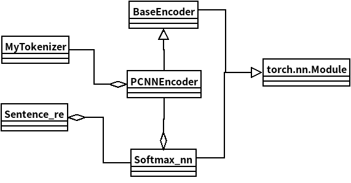

## Relation Extraction

### Overview

Relation extraction(RE) is one of Information Extraction's subtasks, with which we can get useful information from particular text materials. The objective of this task is to compute the relations absorbed in the input sentence or passage with the gotten entities from entity extraction task. Now, relation extraction is usually a classification task. Therefore, particular well-designed relations and well-annotated datasets are needed to achieve the objective.

### Dataset

The dataset usually includes a relation2id file, which has all kinds of relations appearing in the dataset, and a file whose lines are quadri-tuples including a sentence, two entities, and the matching relations. For now, the group don't have a dataset with high quality that is about civil or tunnel engineering. As a result, the group use some general datasets to test the algorithms.

+ English dataset: nyt10(new york times news); wiki80(wikipedia); SemEval2010(from OpenNRE)

  ```json
  % data sample
  {"text": "She also oversaw the refinancing of the state Superfund law ; the creation of a plan for decontaminating heavily polluted Onondaga Lake , near Syracuse ; the acquisition of hundreds of thousands of acres of Adirondack woodlands ; and the imposition of tough new acid rain rules .", "relation": "/location/location/contains", "h": {"id": "m.071cn", "name": "Syracuse", "pos": [143, 151]}, "t": {"id": "m.02_v74", "name": "Onondaga Lake", "pos": [122, 135]}}
  ```

+ Chinese dataset: CCKS2019(a people relation extraction competation's dataset) and Sanwen(a literature dataset), FinRe(a financial news dataset)(from several other git repositories)

  + word-based

  ```json
  {"tokens": ["生活", "的", "磨炼", "使", "母亲", "心胸开阔", "，", "明事", "达理", "，", "和睦", "邻里", "，", "精明能干", "。"], "h": {"name": "母亲", "pos": [4, 5]}, "t": {"name": "邻里", "pos": [11, 12]}, "relation": "Social"}
  ```

  + character-based

  ```json
  {"tokens": ["生", "活", "的", "磨", "炼", "使", "母", "亲", "心", "胸", "开", "阔", "，", "明", "事", "达", "理", "，", "和", "睦", "邻", "里", "，", "精", "明", "能", "干", "。"], "h": {"name": "母亲", "pos": [6, 8]}, "t": {"name": "邻里", "pos": [20, 22]}, "relation": "Social"}
  ```

### Evalution

| dataset                         | token method    | f1 value |
| ------------------------------- | --------------- | -------- |
| Sanwen literature(12 relations) | word-based      | 0.642891 |
| Sanwen literature               | character-based | 0.655973 |
| FinRe financial(44 relations)   | word-based      | 0.520832 |
| FinRe financial                 | character-based | 0.507063 |

### Key Operations

1. **Tokenization and data prepare:** Use some scripts to transform the original dataset to tensor form acting as the model's input.

   + **tokenization**

   For English datasets, the algorithm use " " to split sentences or phrases to words. There are two different tokenization methods for chinese dataset--word-based and character-based method. This step transform the original information to good form, which makes next step easy.

   ```python
   # word-based as example
   # build dictionary
   with open(os.path.join(root_path, "valid.txt"), 'r', encoding='utf-8') as data_file:
       for lines in data_file.readlines():
           if lines == "\n":
               continue
           head = lines.split()[0]
           tail = lines.split()[1]
           jieba.add_word(head)
           jieba.add_word(tail)
   
   with open(os.path.join(root_path, "valid.txt"), 'r', encoding='utf-8') as data_file:
       file = open(os.path.join(go_path, "valid.txt"), 'w', encoding='utf-8')
       for lines in data_file.readlines():
           if lines == "\n":
               continue
               # tokenize the sentence
           head = lines.split()[0]
           tail = lines.split()[1]
           rel = lines.split()[2]
           sentence = lines.split()[3]
           sentence = jieba.cut(sentence)
           tokens = []
           for words in sentence:
               if words == "<" or words == ">":
                   continue
               tokens.append(words)
           data = {"tokens": tokens}
           # add entities and positions
           i = 0
           p1 = p2 = -1
           for words in tokens:
               if words == head:
                   p1 = i
               elif words == tail:
                   p2 = i
               i += 1
           h = {"name": head, "pos": [p1, p1 + 1]}
           t = {"name": tail, "pos": [p2, p2 + 1]}
           data['h'] = h
           data['t'] = t
           data["relation"] = rel
           d = json.dumps(data, ensure_ascii=False)
           if p1 >= 0 and p2 >= 0:
               file.write(d)
               file.write("\n")
       file.close()
   ```

   + **data prepare**

   To achieve the objective of relation extraction, particular data form is designed. All the sentences in dataset can be transform to a 2-D matrix, which includes word embeddings and position embeddings. Word embeddings are vectors, and each vector represents a specific word. Words having similar meanings have closer vectors in the vector space. Position embeddings are different words' distances from entities. Because the datasets have 2 entities in their lines, the position embeddings are 2-D vectors.

   ```python
   # use the gotten word2vec result to make model's dictionary and word embeddings(numpy 2-D array)
   def makeDic(infile, dictionary):
       num = 0
       ndArray = []
       with open(infile, "r", encoding="utf-8") as infile:
           for lines in infile.readlines():
               word = lines.split()[0]
               dictionary[word] = num
               num += 1
               w2v = []
               # print(lines.split()[1])
               for i in range(1, 101):
                   value = float(lines.split()[i])
                   w2v.append(value)
               ndArray.append(w2v)
       return ndArray
   ```

2. **Model**

   The model's framework is like PCNN model mentioned in [paper](https://www.aclweb.org/anthology/D15-1203.pdf), which can be divided in 4 layers. Mainly use [OpenNRE](https://github.com/thunlp/OpenNRE) resporitory to implement, which is based on torch library.

   + **embedding layer:**To concatenate a sentence's all words' word embeddings and position embeddings and transform the gotten array to a torch tensor.
   
     ```python
     import torch.nn as nn
     import torch.nn.functional as F
     # Word embedding
     self.word_embedding = nn.Embedding(self.num_token, self.word_size)
     if word2vec is not None:
             word2vec = torch.from_numpy(word2vec)
             if self.num_token == len(word2vec) + 2:            
                 unk = torch.randn(1, self.word_size) / math.sqrt(self.word_size)
                 blk = torch.zeros(1, self.word_size)
                 self.word_embedding.weight.data.copy_(torch.cat([word2vec, unk, blk], 0))
             else:
                 self.word_embedding.weight.data.copy_(word2vec)
     # Position Embedding
     self.pos1_embedding = nn.Embedding(2 * max_length, self.position_size, padding_idx=0) self.pos2_embedding = nn.Embedding(2 * max_length, self.position_size, padding_idx=0)
     self.tokenizer = WordTokenizer(vocab=self.token2id, unk_token="[UNK]")
     # token 2 embeddings
     indexed_tokens = self.tokenizer.convert_tokens_to_ids(tokens, unk_id=self.token2id['[UNK]'])
     # Position 2 embedding
     pos1 = []
     pos2 = []
     pos1_in_index = min(pos_head[0], self.max_length)
     pos2_in_index = min(pos_tail[0], self.max_length)
     for i in range(len(tokens)):
         pos1.append(min(i - pos1_in_index + self.max_length, 2 * self.max_length - 1))
         pos2.append(min(i - pos2_in_index + self.max_length, 2 * self.max_length - 1))
     # transform 2 tensor
     indexed_tokens = torch.tensor(indexed_tokens).long().unsqueeze(0)  # (1, L)
     pos1 = torch.tensor(pos1).long().unsqueeze(0)  # (1, L)
     pos2 = torch.tensor(pos2).long().unsqueeze(0)  # (1, L)
     # concatenate
      x = torch.cat([self.word_embedding(indexed_tokens),
                            self.pos1_embedding(pos1),
                            self.pos2_embedding(pos2)], 2)  # (B, L, EMBED)
     # x is the final input tensor 
     ```
   
   + **convoluting layer:**Like normal CNN, there are several filters that process convoluted operation with the original tensor. 
   
     ```python
     self.conv = nn.Conv1d(self.input_size, self.hidden_size, self.kernel_size, padding=self.padding_size)
     x = self.conv(x) # pytorch library convlution operation
     ```
   
   + **pooling layer:**Split the received tensor by entities in 3 areas and process max pooling operation in each area. Then process a dropout operation to prevent overfitting.
   
     ```python
     self.drop = nn.Dropout(dropout)
     self.pool = nn.MaxPool1d(self.max_length)
     self.mask_embedding = nn.Embedding(4, 3)
     self.mask_embedding.weight.data.copy_(torch.FloatTensor([[0, 0, 0], [1, 0, 0], [0, 1, 0], [0, 0, 1]]))
     self.mask_embedding.weight.requires_grad = False
     self._minus = -self.pool = nn.MaxPool1d(self.max_length)
     self.act=torch.nn.Module.Functional.relu
     mask = []
     pos_min = min(pos1_in_index, pos2_in_index)
     pos_max = max(pos1_in_index, pos2_in_index)
     for i in range(len(tokens)):
             if i <= pos_min:
                 mask.append(1)
             elif i <= pos_max:
                 mask.append(2)
             else:
                 mask.append(3)
     mask = 1 - self.mask_embedding(mask).transpose(1, 2)  # (B, L) -> (B, L, 3) -> (B, 3, L)
     # pooling and apply relu activation function
     pool1 = self.pool(self.act(x + self._minus * mask[:, 0:1, :]))  # (B, H, 1)
     pool2 = self.pool(self.act(x + self._minus * mask[:, 1:2, :]))
     pool3 = self.pool(self.act(x + self._minus * mask[:, 2:3, :]))
     x = torch.cat([pool1, pool2, pool3], 1)  # (B, 3H, 1)
     x = x.squeeze(2)  # (B, 3H)
     x = self.drop(x)# dropout operation
     ```
   
   + **classifying layer:**Create a random transition matrix and operate it with the received tensor from pooling layer. The result will be a score vector representing all kinds of relations. Use softmax function to transform it to a probability distribution. Then the maximum value will be the prophetic relation. 
   
     ```python
     self.sentence_encoder=PCNNEncoder(*args)
     self.fc = nn.Linear(self.sentence_encoder.hidden_size, num_class)
     self.softmax = nn.Softmax(-1)
     
     logits = self.forward(*item)
     logits = self.softmax(logits)
     score, pred = logits.max(-1)
     
     def forward(self, *args):
         rep = self.sentence_encoder(*args)  # (B, H)
         rep = self.drop(rep)
         logits = self.fc(rep)  # (B, N)
         return logits
     ```

3. **Train**

   Set configuration and train the model.

   ```python
   # load some data
   rel2id = json.load(open(args.rel2id_file))
   
   word2id = json.load(open(os.path.join(root_path, 'word2id.json')), )
   word2vec = np.load(os.path.join(root_path, 'myvec.npy'))
   
   # Define the sentence encoder
   sentence_encoder = opennre.encoder.PCNNEncoder(
       token2id=word2id,
       max_length=args.max_length,
       word_size=100,
       position_size=10,
       hidden_size=230,
       blank_padding=True,
       kernel_size=3,
       padding_size=1,
       word2vec=word2vec,
       dropout=0.5
   )
   
   # Define the model
   model = opennre.model.SoftmaxNN(sentence_encoder, len(rel2id), rel2id)
   
   # Define the whole training framework
   framework = opennre.framework.SentenceRE(
       train_path=args.train_file,
       val_path=args.val_file,
       test_path=args.test_file,
       model=model,
       ckpt=ckpt,
       batch_size=args.batch_size,
       max_epoch=100,
       lr=args.lr,
       weight_decay=args.weight_decay,
       opt='sgd'
   )
   
   # Train the model
   if not args.only_test:
       framework.train_model(args.metric)
   
   # Test
   framework.load_state_dict(torch.load(ckpt)['state_dict'])
   result = framework.eval_model(framework.test_loader)
   ```

4. **Predict**

   Get a json string having a sentence and 2 entities, then return the prophetic relation and the probability.

   ```python
   # load a model
   def getModel(path):
       ckpt = './ckpt/sanwenchar_cnn_soft.pth.tar'
       rel2id = json.load(open(os.path.join(path, 'rel2id.json')))
       word2id = json.load(open(os.path.join(path, 'word2id.json')))
       word2vec = np.load(os.path.join(path, 'myvec.npy'))
       # Define the sentence encoder
       sentence_encoder = opennre.encoder.CNNEncoder(
           token2id=word2id,
           max_length=120,
           word_size=100,
           position_size=10,
           hidden_size=230,
           blank_padding=True,
           kernel_size=3,
           padding_size=1,
           word2vec=word2vec,
           dropout=0.5
       )
       # Define the model
       m = opennre.model.SoftmaxNN(sentence_encoder, len(rel2id), rel2id)
       m.load_state_dict(torch.load(ckpt, map_location='cpu')['state_dict'])
       return m
   # receive a json string and use a model to predict
   def jsonProcess(js, model):
       jsText = json.loads(js)
       tokens = []
       for words in jsText['sentence']:
           if words == "<" or words == ">":
               continue
           tokens.append(words)
       i = 0
       h = {}
       tails = []
       relations = []
       for entity in jsText['entities']:
           i += 1
           if i == jsText["chosen_entity"]:
               h["pos"] = entity
           else:
               tails.append({"pos": entity})
   
       data = {"tokens": tokens, "h": h}
       for entity in tails:
           data["t"] = entity
           relation = model.infer(data)
           relations.append(relation)
       return relations
   ```


### Class Design

#### Overview



#### torch.nn.Module

A Python library's class, for building layers in neural networks. 

#### BaseEncoder

A Opennre implemented class, for setting some basic hyper-parameters of a encoder, such as paths of data files, hidden layers, etc.

##### constructed function

```python
def __init__(self,
             token2id,                          # word embedding dictionary
             max_length=128,         # sentence's max length 
             hidden_size=230,         # the number of hidden layers
             word_size=50,                # word embeddings' max length
             position_size=5,           # position embedding's max length
             blank_padding=True,# padding for CNN
             word2vec=None,         # word embedding numpy
             mask_entity=False):  # mask entities
```

##### methods

1. ```python
   def forward(self, token, pos1, pos2):
   ```

   + parameters:
     + token: sequence of ids in original sentence
     + pos1: sequence of distance to entity1
     + pos2:sequence of distance to entity2
   + return:
     + None

#### PCNNEncoder

A class implementing PCNN model's embedding, convolution, max pooling layers.

##### constructed function

```python
def __init__(self,
             token2id,
             max_length=128,
             hidden_size=230,
             word_size=50,
             position_size=5,
             blank_padding=True,
             word2vec=None,
             kernel_size=3,             # kernel filter size
             padding_size=1,
             dropout=0.0,                # dropout value
             activation_function=F.relu,    # pooling layer activation function
             mask_entity=False):
```

##### methods

1. ```python
   def forward(self, token, pos1, pos2, mask):
   ```

   + parameter:
     + token: sequence of ids in original sentence
     + pos1: sequence of distance to entity1
     + pos2:sequence of distance to entity2
     + mask: entity's mask, a list representing pooling layer's group
   + return
     + x: sentences' tensor form

2. ```python
   def tokenize(self, item): # preprocess the input sentence, using the class MyTokenizer's function
   ```

   + parameter:
     + item: a json string that having a sentence and two entities' positions
   + return:
     + tokens: id sequence of the original sentence
     + pos1: entity1's position embedding
     + pos2: entity2's position embedding
     + mask: sequence of group information for pooling layer

####  Softmax_nn

A class implementing PCNN model's classification layer.

##### constructed function

```python
def __init__(self, sentence_encoder, num_class, rel2id):
```

+ parameter:
  + sentence_encoder: model's encoder, using class PCNNEncoder
  + num_class: the number of relation's kinds
  + rel2id: a dictionary of ids and relations

##### methods

1. ```python
   def infer(self, item):
   ```

   + parameter
     + item: a json string that having a sentence and two entities' positions
   + return
     + id2rel: the relation prediction
     + score: the computed probability

2. ```python
   def forward(self, *args):
   ```

   + parameter
     + *args: depend different sentence encoder's needed parameter
   + return
     + logits: a list of probability distribution of different relations

#### Sentence_re

A opennre implemented training framework class.

##### constructed function

```python
def __init__(self, 
             model,              # the training model, use class softmax_nn
             train_path,     # training dataset txt path
             val_path,         # validating dataset txt path
             test_path,       # testing dataset txt path
             ckpt,                 # model's saving path
             batch_size=32,   
             max_epoch=100, 
             lr=0.1,              #    optimizer's parameters
             weight_decay=1e-5, 
             warmup_step=300,
             opt='sgd'):
```

##### methods

1. ```python
   def train_model(self, metric='acc'):
   ```

   + parameter:
     + metric: the validating method's type, saving the best model based on this parameter
   + return:
     + None

2. ```python
   def eval_model(self, eval_loader):
   ```

   + parameter
     + eval_loader: data_loader class of validating dataset
   + return
     + result: precision, recall and other kinds of evaluating scores on the validating dataset 

3. ```python
   def load_state_dict(self, state_dict):
   ```

   + parameter
     + state_dict: a file saving several model's parameter trained before 
   + return
     + None

#### MyTokenizer

A class for tokenizing given data, building word dictionaries, and making word embeddings.

##### constructed function

``` python
def __init__(self, root_file)
```

+ parameter:
  +  root_file: path of the root file dictionary

##### methods 

1. ``` python
   def utils(self, method="char"):
   ```

   + parameter
     + method: cut sentence by chars or by words
   + return
     + None

2. ``` PYTHON
   def makeDic(self,method="char",infile,dictionary): # make dictionary and save numpy file
   ```

   + parameter:
     + method: dictionary type
     + infile: a file's path with some sentences, taking words or characters from the file
     + dictionary:json file path, where to add new words or characters
   + return
     + None

