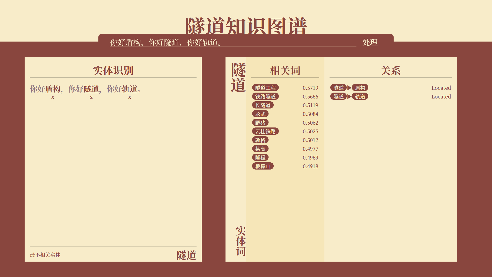
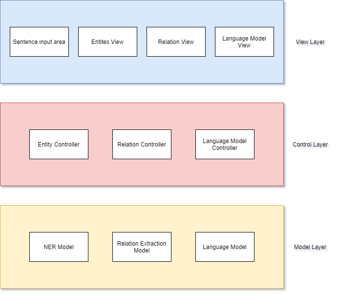
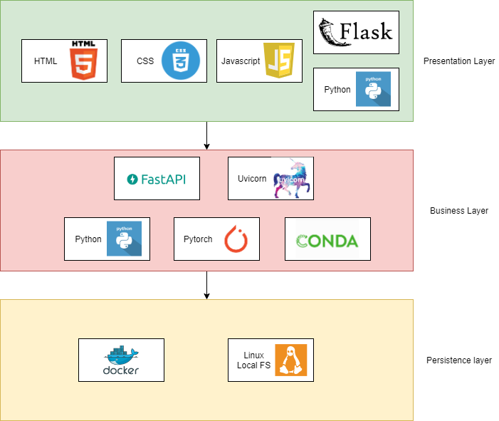

# High-level Design Document

## Prototype Design



## Business Architecture



## Technology Architecture




## Data Modeling

Since our project are based on dataset instead of database, we use local file system for storing data.

## Interface Design Document

### baseurl/re

**Request Method**: POST

**Description**

Receive a json string including a sentence and its entities' positions and use a model to compute the appropriate relations between a chosen entity and others.

**Parameter**

| Name          | Located in | Type    | Description                                 | Required |
| ------------- | ---------- | ------- | ------------------------------------------- | -------- |
| sentence      | form       | String  | the needed sentence                         | Yes      |
| entities      | form       | List    | the entities' position in the sentence      | Yes      |
| chosen_entity | form       | Integer | the chosen entity's id in the entities list | Yes      |

**Return**

| Code | Description         | Type |
| ---- | ------------------- | ---- |
| 200  | Successful response | JSON |

**Sample Request**

```http
POST baseurl/re
```

```json
% body:
{
    "sentence": "通过盾构外壳和管片支承四周围岩防止发生往隧道内的坍塌",
    "entities": [
        [2, 5],
        [7, 8],
        [13, 14],
        [20, 21]
    ],
    "chosen_entity": 1
}
```

**Sample Return**

Body:

```JSON
[
    "Located",
    " ",
    "Located",
    "Located"
]
```

### baseurl/chineseNER/{input_str}

**Request Method**: GET

**Description**

use model to find the entity in the input sentence

**Parameter**

| Name      | Located in | Type   | Description    | Required |
| --------- | ---------- | ------ | -------------- | -------- |
| input_str | url        | String | input sentence | Yes      |

**Return**

| Code | Description | Type |
| ---- | ----------- | ---- |
| 200  | OK          | JSON |

**Sample Request**

```http
GET baseurl/chineseNER/你好隧道，你好盾构机
```

**Sample Return**

Status: 200 OK

Body:

```JSON
[
    {
        "start": 2,
        "stop": 4,
        "word": "隧道",
        "type": "x"
    },
    {
        "start": 7,
        "stop": 9,
        "word": "盾构",
        "type": "x"
    }
]
```


