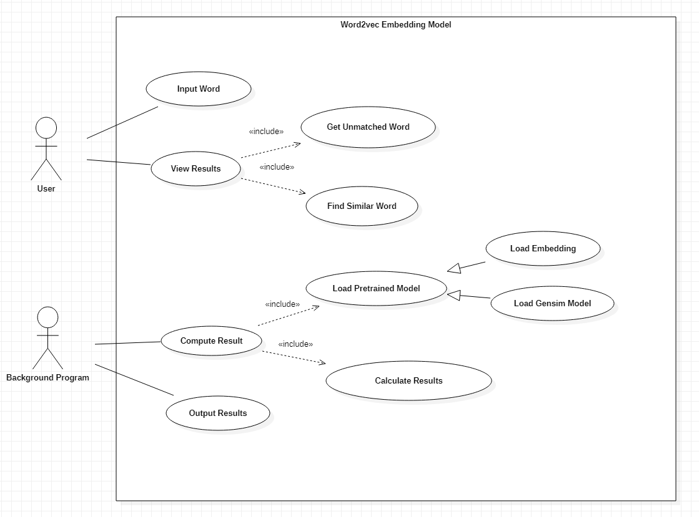

# Requirement Specification

## Project Scope

### Background

Knowledge Graph(KG) is a structural semantic knowledge base, which can quickly describe concepts and their interrelations in the physical world. With knowledge graphs, we can reduce data granularity from document to data level, and implement rapid response and inference of specific areas. Several successful instances of KG, such as *BioBERT* in biological medicine, has been published. But up till now, no instance of KG in civil engineering has been published yet. Thus, this project has an objective of constructing a knowledge graph in the field of civil engineering. The KG constructed by us was initially aimed at tunnel engineering. With the generalization ability of model, we has extended the scope of KG into civil engineering currently.

However, constructing a monolithic knowledge graph is a quite hard job, so the project group now focuses on a kernel step—information extraction, for the stable acquisition of data in high quality. To be more specific, information extraction is composed by relation extraction and named entity recognition(NER). NER recognize named entities (mostly field-related terms) and extracts them from sentence. Relation extraction classifies the relations between every two entities in the sentence given. To get better model, we need particular word embeddings(mapping words and entities to vectors), which is the result of language model. With the language model, we can also find the most unrelated entity in the sentence and give related words of entity specified. The most popular methods to finish these three tasks(NER, relation extraction, language model)  are based on neural network and machine learning.

### Purpose

+ input a sentence, and get entities, relations of these entities, related words of entities in the sentence.
+ getting well-trained Chinese information extraction models with high precision dealing with text in civil engineering domain.

### Target Users

+ users wanting to process information extraction on their passages.
+ researchers focusing on information extraction

### Boundary of the Project

+ what can we do
  + the website that can receive a Chinese sentence, and return several entities in the sentence.
  + after receiving a sentence, the website can return the related words of an entity when the user choose it
  + after receiving a sentence, the website can return the relations between an entity and other entities in the sentence when the user choose it.
  + the project provides interfaces for training and testing models
  + the project provides interfaces for dataset preprocessing.
+ what we cannot do
  + can't extract relations precisely in civil engineering domain because of the lack of training datasets 

## Use Case Analysis

### Language Model Use-case diagram   

### Use Case: Input Word

#### Use Case Name

-  Input Word

#### Identifier

- UC001

#### **Summary Description**

- user input the word they want to use in the word2vec language model

#### Actor

- User

#### Frequency

- high

#### State

- pass

#### **Pre-Condition**

- There is an active connection to the model and network.

#### **Post-Condition**

- The background program has received the input word
- The background program output the compute results

#### Extended Use Case

- None

#### Included Use Case

- None

#### Basic Flows

1. User open the website
2. User click the input bar
3. User input the word

#### Alternative Flows

- User can rewrite the word in input bar again

-----------

### Use Case: View Results

#### Use Case Name

-  View Results

#### Identifier

- UC002

#### **Summary Description**

- User view the results computed and outputted by the background program 

#### Actor

- User

#### Frequency

- high

#### State

- pass

#### **Pre-Condition**

- There is an active connection to the model and network.
- User has inputted the word with right format
- The website has connected to the background program

#### **Post-Condition**

- The background program show the result through website

#### Extended Use Case

- None

#### Included Use Case

- Get Unmatched Word
- Find Similar Word

#### Basic Flows

1. User click the confirm button
2. The website received the results from background program
3. The website show the results to user
4. User view different results in separate area

#### Alternative Flows

- None

------

### Included Use Case: Get Unmatched Word

#### Use Case Name

-  Get Unmatched Word

#### Identifier

- UC003

#### **Summary Description**

- User view the unmatched word computed and outputted by the background program 

#### Actor

- User

#### Frequency

- high

#### State

- pass

#### **Pre-Condition**

- There is an active connection to the model and network.
- User has inputted the word with right format
- The website has connected to the background program

#### **Post-Condition**

- The background program show the unmatched word through website

#### Extended Use Case

- None

#### Included Use Case

- None

#### Basic Flows

1. User click the confirm button
2. The website received the unmatched word from background program
3. The website show the unmatched word to user
4. User view unmatched word in its area

#### Alternative Flows

- None

-----

### Included Use Case: Find Similar Word

#### Use Case Name

-  Find Similar Word

#### Identifier

- UC004

#### **Summary Description**

- User view the similar word computed and outputted by the background program 

#### Actor

- User

#### Frequency

- high

#### State

- pass

#### **Pre-Condition**

- There is an active connection to the model and network.
- User has inputted the word with right format
- The website has connected to the background program

#### **Post-Condition**

- The background program show the similar word through website

#### Extended Use Case

- None

#### Included Use Case

-  None

#### Basic Flows

1. User click the confirm button
2. The website received the similar word from background program
3. The website show the similar word to user
4. User view similar word in its area

#### Alternative Flows

- None

----

### Use Case: Compute Results

#### Use Case Name

-  Compute Results

#### Identifier

- UC005

#### **Summary Description**

- Background program compute the result of word inputted by user

#### Actor

- Background program

#### Frequency

- high

#### State

- pass

#### **Pre-Condition**

- There is an active connection to the model and network.
- User has inputted the word with right format

#### **Post-Condition**

- The background program get the computed result

#### Extended Use Case

- None

#### Included Use Case

- Load pretrained model
- Calculate word embedding

#### Basic Flows

1. Background program received word inputted by user from website
2. Background program compute the embedding of word
3. Background program compute the result of word.

#### Alternative Flows

- Background program can return corresponding message when meet error

----

### Included Use Case: Load Pretrained Model

#### Use Case Name

-  Load Pretrained Model

#### Identifier

- UC006

#### **Summary Description**

- Background program load the pretrained model

#### Actor

- Background program

#### Frequency

- high

#### State

- pass

#### **Pre-Condition**

- There is an active connection to the model and network.
- The background program has connected to right model file

#### **Post-Condition**

- The background program load the model

#### Extended Use Case

- None

#### Included Use Case

- None

#### Basic Flows

1. Background program start computing results
2. Background program locate the path of model
3. Background program load the model into program

#### Alternative Flows

- Background program can return corresponding message when missing the model file

----

### Son Use Case: Load Embedding

#### Use Case Name

-  Load Embedding

#### Identifier

- UC007

#### **Summary Description**

- Background program load the keyed vectors embedding file

#### Actor

- Background program

#### Frequency

- high

#### State

- pass

#### **Pre-Condition**

- There is an active connection to the model and network.
- The background program has connected to right model file

#### **Post-Condition**

- The background program load the embedding file

#### Extended Use Case

- None

#### Included Use Case

- None

#### Basic Flows

1. Background program start computing results
2. Background program locate the path of embedding file
3. Background program load the keyed vectors embedding model into program

#### Alternative Flows

- Background program can return corresponding message when missing the embedding file

----

### Son Use Case: Load Gensim Model

#### Use Case Name

-  Load Gensim Model

#### Identifier

- UC008

#### **Summary Description**

- Background program load the gensim word2vec model

#### Actor

- Background program

#### Frequency

- high

#### State

- pass

#### **Pre-Condition**

- There is an active connection to the model and network.
- The background program has connected to right model file

#### **Post-Condition**

- The background program load the gensim word2vec model

#### Extended Use Case

- None

#### Included Use Case

- None

#### Basic Flows

1. Background program start computing results
2. Background program locate the path of gensim model
3. Background program load the gensim word2vec model into program
4. Background program extract the embedding information from gensim model

#### Alternative Flows

- Background program can return corresponding message when missing the gensim word2vec model

----

### Included Use Case: Calculate Word Embedding

#### Use Case Name

-  Calculate Word Embedding

#### Identifier

- UC009

#### **Summary Description**

- Background program calculate the embedding of target word

#### Actor

- Background program

#### Frequency

- high

#### State

- pass

#### **Pre-Condition**

- User has inputted the word with right format
- There is an active connection to the model and network.
- The background program has connected to right model file

#### **Post-Condition**

- The background program get the calculated result.

#### Extended Use Case

- None

#### Included Use Case

- None

#### Basic Flows

1. Background program load the target word inputted by user
2. Background program search the embedding of target word from model
3. Background program calculated the most similar embedding vectors of target word
4. Background program calculated the embedding subtraction
5. Background program find the most similar word and unmatched word by calculated embedding

#### Alternative Flows

- None

----

### Use Case: Output Results

#### Use Case Name

-  Output Results

#### Identifier

- UC010

#### **Summary Description**

- Background program output the calculated results to website

#### Actor

- Background program

#### Frequency

- high

#### State

- pass

#### **Pre-Condition**

- There is an active connection to the website and network.
- The background program has connected to right model file
- The results have been calculated successfully.

#### **Post-Condition**

- The website has received the result from background program.

#### Extended Use Case

- None

#### Included Use Case

- None

#### Basic Flows

1. Background program emcapsulate the calculated result with specific format type
2. Background program send the result to website

#### Alternative Flows

- None

------------

### Named Entity Recognition Use-case diagram

### Use Case: View Results

#### Use Case Name

- NER Model Manage

#### Identifier

- UC101

#### **Summary Description**

- Background Program manage the model for prediction

#### Actor

- Background Program

#### Frequency

- high

#### State

- pass

#### **Pre-Condition**

- The server storing model is working

#### **Post-Condition**

- The background program can train model or predict result.

#### Extended Use Case

- None

#### Included Use Case

- Train Model

#### Basic Flows

1. Background program turn on model service
2. Others use the model.

#### Alternative Flows

- None

------

### Included Use Case: Prediction of Entities

#### Use Case Name

- Prediction of Entities

#### Identifier

- UC102

#### **Summary Description**

- Background program prepare the model for prediction.
- User input the sentence for prediction of entities.

#### Actor

- User
- Background program

#### Frequency

- high

#### State

- pass

#### **Pre-Condition**

- There is an active connection to the model and network.

#### **Post-Condition**

- The background program receives the input sentence
- The background program outputs the prediction result.

#### Extended Use Case

- None

#### Included Use Case

- None

#### Basic Flows

1. User open the website
2. User click the input bar
3. User input the sentence

#### Alternative Flows

- User can rewrite the sentence in input bar again

------

### Included Use Case: Train model

#### Use Case Name

- Train model

#### Identifier

- UC103

#### **Summary Description**

- Background program train model to achieve better performance

#### Actor

- Background program

#### Frequency

- high

#### State

- pass

#### **Pre-Condition**

- There is a suitable device for training

#### **Post-Condition**

- The performance of model changes.

#### Extended Use Case

- None

#### Included Use Case

- Process Data
- Load Pretrained Model
- Fine Tuning
- Evaluate

#### Basic Flows

1. User click the confirm button
2. The website received the unmatched word from background program
3. The website show the unmatched word to user
4. User view unmatched word in its area

#### Alternative Flows

- None

------

### Included Use Case: Process Data

#### Use Case Name

- Process data

#### Identifier

- UC104

#### **Summary Description**

- Data manager provide the original dataset.
- Background program process the data to meet the needs of training

#### Actor

- Data manager
- Background program

#### Frequency

- high

#### State

- pass

#### **Pre-Condition**

- Original dataset is ready

#### **Post-Condition**

- Produce a dataset tailored for training

#### Extended Use Case

- None

#### Included Use Case

- None

#### Basic Flows

1. Data manager provides original dataset.
2. The background program runs a script to modify dataset
3. The background program saves modified dataset.

#### Alternative Flows

- None

------

### Included Use Case: Load Pretrained Model

#### Use Case Name

- Load Pretrained Model

#### Identifier

- UC105

#### **Summary Description**

- Background program load ALBERT or BERT for training

#### Actor

- Background program

#### Frequency

- high

#### State

- pass

#### **Pre-Condition**

- There is an downloaded pretrained model
- There is enough free memory in CUDA

#### **Post-Condition**

- The pretrained model is loaded into CUDA

#### Extended Use Case

- None

#### Included Use Case

- None

#### Basic Flows

1. Background program runs script
2. The pretrained model is loaded

#### Alternative Flows

- Return an error if there are no space left in device

------

### Included Use Case: Fine Tuning

#### Use Case Name

- Fine Tuning

#### Identifier

- UC106

#### **Summary Description**

- Background program fine-tune pretrained model to achieve better performance

#### Actor

- Background program

#### Frequency

- high

#### State

- pass

#### **Pre-Condition**

- Pretrained model is loaded
- Pre-processed dataset is ready

#### **Post-Condition**

- The performance of model is changed

#### Extended Use Case

- None

#### Included Use Case

- None

#### Basic Flows

1. Background program modify model's parameters
2. Background program run model on training dataset

#### Alternative Flows

- None

------

### Included Use Case: Evaluate

- Load Embedding

#### Identifier

- UC107

#### **Summary Description**

- Background program evaluate the performance of the model

#### Actor

- Background program

#### Frequency

- high

#### State

- pass

#### **Pre-Condition**

- Model is trained for some epochs

#### **Post-Condition**

- The background program return a score

#### Extended Use Case

- None

#### Included Use Case

- None

#### Basic Flows

1. Background program start evaluate
2. Background program run model on testing dataset
3. Background program return precision and f1 score

#### Alternative Flows

- None

-------------------

### Relation Extraction Use-case Diagram

### Use Case: Input Data

#### Use Case Name

+ Input Data

#### Identifier

+ UC201

#### Summary Description

+ Load the sentence inputed by users and entities' positions detected by the NER model into the Relation Extraction model, then the sentence will be tokenized by words or characters before the model extracting the relations.

#### Actor

+ User

#### Frequency

+ High

#### State

+ Pass

#### Pre-Condition

+ There is an active connection to the modesl and network.
+ The NER model is able to find out the entities in the inputed sentence accurately.

#### Post-Condition

+ The background program recieves the inputed data and preprocess it.
+ The background program output the extracted relations, which shows on the website.

#### Extended Use Case

+ None

#### Included Use Case

+ Input sentence
+ Input entity

#### Basic Flows

1. User open the website
2. User input the sentence
3. User choose one specific entity from all entities given by the NER model.

#### Alternative Flows

+ User can choose different entities

--------------------

### Use Case: View Example

#### Use Case Name

+ View Example

#### Identifier

+ UC202

#### Summary Description

+ User can choose some data examples to find out the required format
+ This use case has been eliminated because it's no longer needed. The previous version of the program needs to receive an more elaborate format, which add some extra troubles.  

#### Actor

+ User

#### Frequency

+ High

#### State

+ Failed

#### Pre-Condition

+ There is an active connection to the network.

#### Post-Condition

+ None

#### Extended Use Case

+ None

#### Included Use Case

+ None

#### Basic Flows

1. User open the website
2. User view the examples

#### Alternative Flows

+ None

-------------

### Use Case: Get Prediction

#### Use Case Name

+ Get Prediction

#### Identifier

+ UC203

#### Summary Description

+ The relation extraction model receives the data inputed by the user and get results, which will be shown on the website later.

#### Actor

+ User

#### Frequency

+ High

#### State

+ Pass

#### Pre-Condition

+ There is an active connection to the network and model.
+ User has inputted the word with right format
+ There are several accurately detected entities given by NER model

#### Post-Condition

+ The website shows the extracted relations

#### Extended Use Case

+ None

#### Included Use Case

+ Get Result
+ Get Precision

#### Basic Flows

1. User confirms the input data
2. The background program retouch the sentence to a list of tokens
3. The inputed data is transfered to a tensor and go through the neural network
4. The model outputs the reult and transmits to the website
5. The website shows the reults. 

#### Alternative Flows

+ None

------------------

### Use Case: Apply pretrained models

#### Use Case Name

+ Apply pretrained models

#### Identifier

+ UC204

#### Summary Description

+ use well-designed scripts to transfer the original word2vec-trained or bert-trained word embedding files that are in txt format, whcih is quite common, to the npy format(numpy array),which are prepared for training process or the predicting process.
+ A word2id json file is also made during the process, in order to connect each word to its vector in the numpy array.

#### Actor

+ Background program

#### Frequency

+ low

#### State

+ pass

#### Pre-Condition

+ There are some word embedding data in txt format including words/characters and their vectors.

#### Post-Condition

+ The npy and json files are then used as the parameters of the model's sentence encoder

#### Extended Use Case

+ None

#### Included Use Case

+ None

#### Basic Flows

1. Background program runs script
2. The pretrained word embedding is loaded

#### Alternative Flows

+ None

------

### Use Case: Training models

#### Use Case Name

+ Training Models

#### Identifier

+ UC205

#### Summary Description

+ use different sentence encoders(CNN/PCNN/Bert) , and classifier(Softmax, ATT bag-case) to complete a relation-extraction model. Then, training models with different preprocessed datasets

#### Actor

+ Background program

#### Frequency

+ medium

#### State

+ pass

#### Pre-Condition

+ There are some preprocessed dataset can be used as the input data
+ The background program has set some well-defined config for the training process, such as epoch, batch, word embedding's dimension, drop out value, etc.

#### Post-Condition

+ The best model evaluated by different methods(AUG, F1, precision) is saved

#### Extended Use Case

+ None

#### Included Use Case

+ evaluate
+ suspend|continue training

#### Basic Flows

1. set the config of the training process
2. running the training scripts
3. save the best model and show the model's F1, AUG, precision, recall value

#### Alternative Flows

+ None

-----

### Included Use Case: Evaluate

-  Evaluate

#### Identifier

- UC206

#### **Summary Description**

- Background program evaluate the performance of the model for each epoch

#### Actor

- Background program

#### Frequency

- high

#### State

- pass

#### **Pre-Condition**

- Model has been trained for one epoch

#### **Post-Condition**

- The background program return scores by applying different evaluate methods(precision,f1,AUG,recall)

#### Extended Use Case

- None

#### Included Use Case

- None

#### Basic Flows

1. Background program trains the model for one epoch
2. Background program run model on eval dataset
3. Background program return precision, recall, f1 and AUG score

#### Alternative Flows

- None

----------------

### Included Use Case: Suspend|continue training

-  Suspend|continue training

#### Identifier

- UC207

#### **Summary Description**

- Background program save the best model after each epoch of training, which can be reloaded for futher training

#### Actor

- Background program

#### Frequency

- high

#### State

- pass

#### **Pre-Condition**

- Model is trained for several epochs

#### **Post-Condition**

- A best model's checkpoint is saved

#### Extended Use Case

- None

#### Included Use Case

- None

#### Basic Flows

1. Background program trains the model for one epoch
2. Background program check if it's a better model and save it if it's better
3. repeat 1~2 until the background program is suspended

#### Alternative Flows

- if continuing the training is necessary, background program can reload the saved checkpoints for further training.

----------

### Use Case: Load Dataset

#### Use Case Name

+ Load dataset

#### Identifier

+ UC208

#### Summary Description

+ use well-designed scripts to tokenize the sentences in the original dataset and factory the original data to json strings, which can be loaded as dictionaries and used as models' parameters.

#### Actor

+ Background program

#### Frequency

+ low

#### State

+ pass

#### Pre-Condition

+ There are some data in txt format including a sentence, two entities , the relationship of the two entities in each line of the file(it is the most common dataset in chinese relation extraction area)

#### Post-Condition

+ The json files are then used as the parameters of the model

#### Extended Use Case

+ None

#### Included Use Case

+ None

#### Basic Flows

1. load the original data file(rel2id,data)
2. append all relations to a dictionary and save it as a json file
3. calculate the position of the entities in one sentence
4. tokenize the sentence and get a list of words or characters
5. append the tokenized list, position of entities and the relation of entities in a dictionary, and write the json string in a new data file
6. repeat 3~5 until all lines in the original data file are processed.
7. split the datafile by rate: 6:2:2(train:eva:test)

#### Alternative Flows

+ None