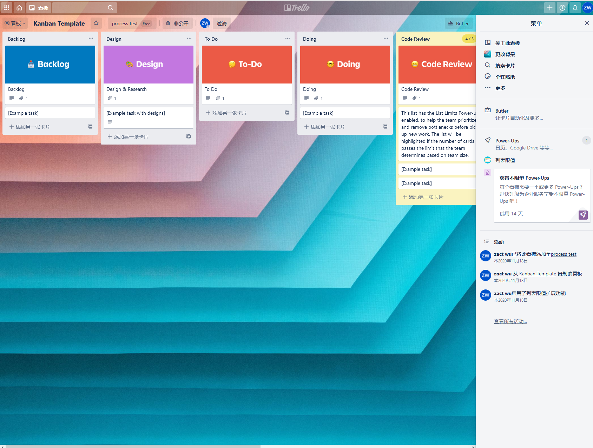
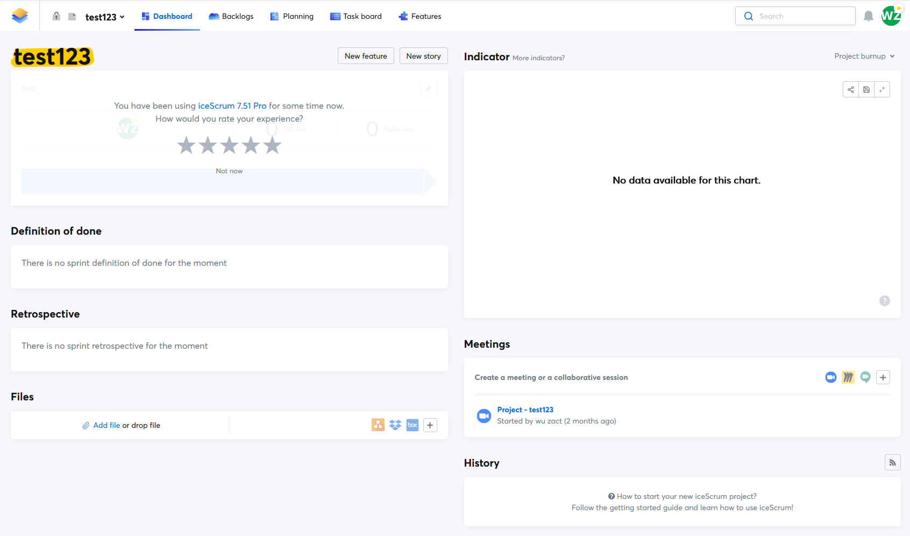
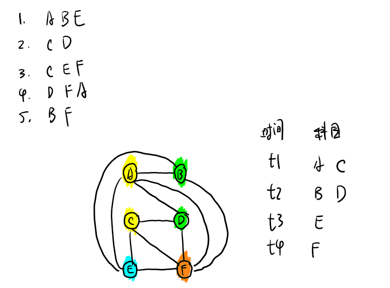
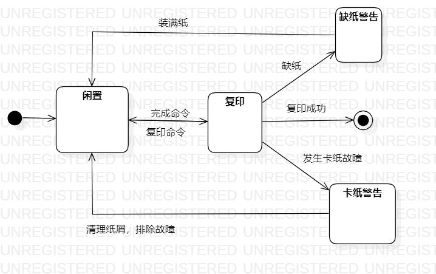

# 练习与讨论题

## 1. 微服务与Devops

### 微服务

维基上对其定义为：一种软件开发技术- 面向服务的体系结构（SOA）架构样式的一种变体，将应用程序构造为一组松散耦合的服务。在微服务体系结构中，服务是细粒度的，协议是轻量级的。

### Devops

**定义：**DevOps（Development和Operations的组合词）是一组过程、方法与系统的统称，用于促进开发（应用程序/软件工程）、技术运营和质量保障（QA）部门之间的沟通、协作与整合。DevOps一词的来自于Development和Operations的组合，突出重视软件开发人员和运维人员的沟通合作，通过自动化流程来使得软件构建、测试、发布更加快捷、频繁和可靠。

**特点：**DevOps提倡小规模和增量的批量大小，而微服务架构帮助我们以一种细粒度的方式开发、测试和发布服务。

**目标：**DevOps希望做到的是软件产品交付过程中IT工具链的打通，使得各个团队减少时间损耗，更加高效地协同工作。**DevOps的一个巨大好处就是可以高效交付，这也正好是它的初衷。**

规划与设计-》代码-》构建-》测试-》发布-》部署-》运维-》监控

### 微服务与Devops的关系

微服务与devops是相辅相成的，微服务类似工厂流水线上的产品，而devops类似流水线本身。

### 微服务|Devops解决的问题

把一个大的单体应用拆分成多个微服务之后，每个服务都可以独立进行开发、测试和运维。

- 微服务的实施，必然会涉及多个微服务之间的协作，那么对微服务功能进行单元测试、回归测试、性能测试将变得更加复杂，如果不采用自动化工具，工作量之大，复杂度之高，难以估量。需求的管理，则项目的管控将异常艰巨
- 微服务部署所依赖的基础环境，必将异常复杂繁琐，，必然会频繁的进行应用的更新，代码编译、版本控制、代码质量将无法保证

----------------

## 4.理解图2.1并找一些过程工具

软件工程是一种层次化的技术，任何工程方法（包括软件工程）必须构建在质量承诺的基础之上。全面质量管理、六西格玛和类似的理念促进了持续不断的过程改进文化，正是这种文化最终引导人们开发出更有效的软件工程方法。支持软件工程的根基在于质量关注点。

软件工程的基础是过程层。软件过程将各个技术层次结合关键点软件工在一起，使得合理、及时地开发计算机软件成为可能。过程定义了一个框架，构建该框架是有效实施软件工程技术必不可少的。软件过程构成了软件项目管理控制的基础，建立了工作环境以便于应用技术方法、提交工作产品（模型、文档、数据、报告、表格等）、建立里程碑、保证质量及正确的管理变更
软件工程方法为构建软件提供技术上的解决方法（如何做）。方法覆盖面很广，包括沟通、需求分析、设计建模、程序构造、测试和技术支持。软件工程方法依赖于一组基本原则，这些原则涵盖了软件工程所有技术领域，包括建模活动和其他描述性技术等。
软件工程工具为过程和方法提供自动化或半自动化的支持。这些工具可以集成起来，使得一个工具产生的信息可被另外一个工具使用，这样就建立了软件开发的支撑系统，称为计算机辅助软件工程

我们寻找到的过程工具有trello和ice scrum，并分别尝试安装和使用了他们

## 5. XP或Scrum实例

### 诺基亚实现scrum

提出一系列具有明确目的性的问题，通过对问题的回答，即可判断是否真正实现了Scrum。

+ 首先用4个问题，判断是否真正实现了迭代开发：
  1. 你们有固定的迭代周期么？你们的迭代周期是否以某个特定的时间开始并以某个固定的时间结束，且迭代周期必须少于6周？（回答否定的则不符合迭代开发原则）
  2. 在每个迭代周期结束时，你们能提供可以工作的软件么？（回答否定的则不符合迭代开发原则）
  3. 在迭代开始之前，你们是否需要必须有一个完整细致的需求说明？（回答肯定的则不符合迭代开发原则）
  4. 是否将测试作为迭代增量开发的一部分，在开发过程中进行测试？（回答否定的则不符合迭代开发原则）

+ 接下来，用4个附加的Scrum规则来判断是否实现了Scrum：
  1. 你们是否有产品所有者？是不是有人可以代表客户和你们一起工作？
  2. 如果有产品所有者的话，他们是否能提供待开发的产品Backlog？且此产品Backlog是否按照优先级来排序的？是否估算过开发这些功能的所需时间？
  3. 团队在开发过程中是否使用了Burndown图来展示工作量变化、跟踪进度、推算团队开发速度？
  4. 在迭代过程中，是否能保证项目经理不干涉团队工作？

**以上八点基本上就可以确定团队是否真正的实现了Scrum。**

### 谷歌实现scrum

+ 项目实例：google Adwords

google adwords是谷歌出品的软件项目，项目目标是为各种规模的企业提供最有效的广告服务。包括以下服务：

1. 让寻求产品或服务的客户看到广告
2. 每千次展示费用定价 - 面向那些希望针对具体的内容网站，并通过展示次数付费的用户
3. 全面控制广告预算
4. 轻松制作和修改广告
5. 可以在完成制作后几分钟内在 Google 上看到广告

-----------------------

**google实施Scrum的过程，是一个逐步演进的过程：**

google AdWords项目中，产品所有者Mark Striebeck逐步引入Scrum。

+ 为应对采用scrum方法后，工作有可能不能按时交付这一问题，Mark建议引入敏捷开发中的Burndown图的实践，来试试效果。
+ 再面对多个开发团队checkout代码造成的代码冲突bug，Mark又建议尝试另一个敏捷实践：每日例会。此后，Mark逐步将Scrum的整个流程系统的引进来。

**google AdWords项目的启示**：在传统的开发团队中，是可以逐步引入Scrum的，但最终必须系统的完整引入。如果在实践期间发现了问题，那正是由于引入Scrum才发现了这些深埋的问题，而此时应该要求我们做的不是放弃Scrum，而是坚定信念完整的引入Scrum。

## 8.设计一种数据结构来安排考试

使用无向图来作为解决方案的数据结构，图中顶点表示课程，在不能同时考试的课程间连线，使该问题转化为无向图的着色问题，用最少的颜色对无向图的顶点着色，并保证任两个相连通的顶点具有不同的颜色，而同种颜色便表示相同的考试时间，图着色算法使用回溯法，过程如图：

## 9. 打印机的状态图

