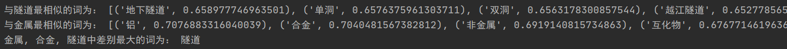
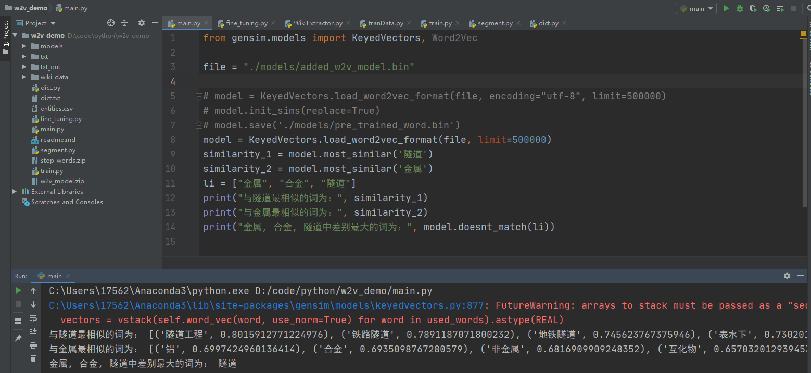

# 武信庭-第八周-word2vec模型对比试验

## 本周进度

将维基百科语料库wiki_zh单独训练成模型对比原先模型下效果

## 1. word2vec对比实验

#### 实验目的

将维基百科语料库wiki_zh单独训练的模型作为对照，通过土木领域词语的预测结果，表现改进后的模型效果

#### 实验成果

1. wiki语料库单独训练模型预测土木领域词汇效果：

2. 加入土木语料后训练模型预测效果对比

