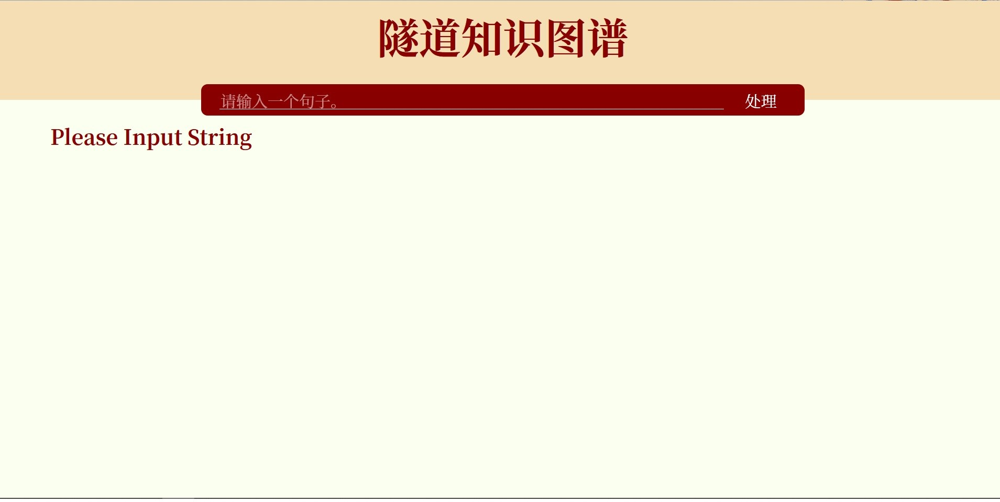
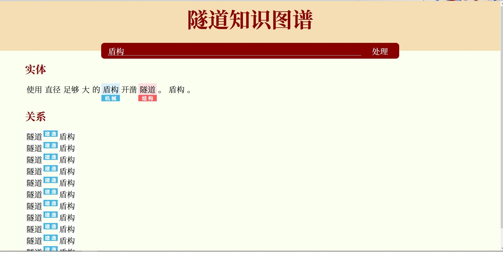

这一周的工作内容主要是实现一个基于flask的前后端。并给调用模型提供接口`ProcessSentence.py`。

## 文档树

```
.
│  README.md
│  screenshot0.jpg # 前端网页截图
│  screenshot1.jpg # 前端网页截图
│
└─src # 前后端代码
    │  main.py # 主模块
    │  ProcessSentence.py # 与模型接口
    │  RetTypes.py # 定义返回类型
    │
    ├─static
    │      style.css
    │
    └─templates
            index.html
```

## ProcessSentence.py（接口文档）

函数接受一个`str`作为输入字符串。要求的返回类型如下所示：

```python
words: list[tuple[str, EntityType]]
relations: list[tuple[RelationType, int, int]]
```

`words[]`返回量定义为由*词语*构成的列表。每个*词语*是一个`tuple[str, EntityType]`元组。元组的第零个分量是词语字符串，第一个是其所在的实体类别（若无则为空）。

`relations[]`返回量定义为由*关系*构成的列表。每个*关系*是一个`tuple[RelationType, int, int]`元组。元组的第零个分量是关系类别，第一、二2个分量是词语在`words[]`中的下标。

目前`EntityType`和`RelationType`均定义为`str`。

## index.html

目前的界面设计效果如下：



